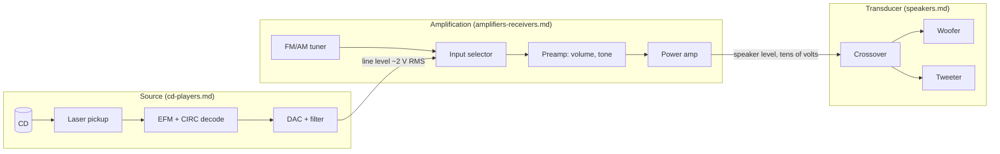
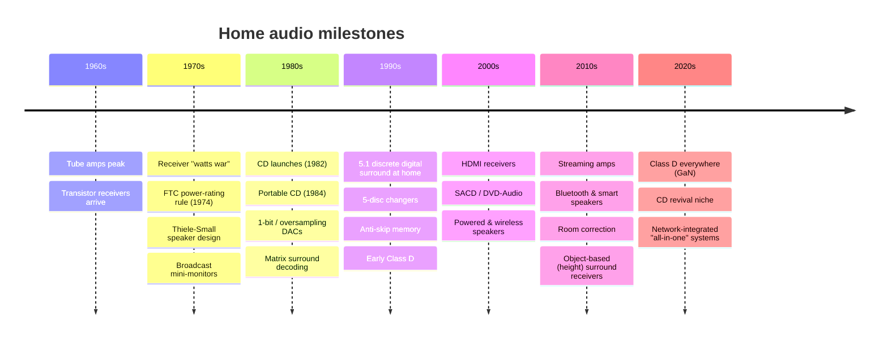

# Home Audio Research: CD Players, Speakers, Amplifiers & Receivers

A history, a technical breakdown and emulation-ready blueprints for three families of home audio gear.

| Document | Covers | Era |
|---|---|---|
| [cd-players.md](cd-players.md) | Compact Disc players, transports, DACs, portables, changers | 1982 – now |
| [speakers.md](speakers.md) | Passive and active loudspeakers, enclosures, drivers, crossovers | 1970s – now |
| [amplifiers-receivers.md](amplifiers-receivers.md) | Tube, solid-state, Class D amps; stereo and A/V receivers; tuners | 1960s – now |
| [blueprints.md](blueprints.md) | Generic reference designs: block diagrams, circuits, formulas, parameter tables, pseudo-code | All |
| [emulation-spec.md](emulation-spec.md) | A software architecture and data schema for a coding agent (such as Codex) to build simulators of all three | All |

## How the three fit together

## Timeline at a glance

## Fictional catalog

**Every brand and model name in these documents is invented** so nothing copies a real trademark or
product. Each fictional model is a stand-in for a typical product of its era. Standards (Red Book,
S/PDIF, HDMI, Thiele-Small, RIAA) keep their real names because they are public technical specs.

| Fictional brand | Category | Models |
|---|---|---|
| Aurion | CD players | CDX-1 (1982 front loader), Pocket P-1 (1984 portable), P-10 ESP (1995 anti-skip portable) |
| Halden | CD players | CP-14 (1983 14-bit oversampling top loader), H-7 (2022 hi-fi player) |
| Veltro | CD players | BitStream B-1 (1990 1-bit), Carousel C-5 (1992 5-disc changer) |
| Meridale | CD transport + DAC | T-1 transport, D-1 DAC (1996) |
| Kestrel | Speakers | AS-10 (1972 acoustic suspension), M-3 (1976 mini-monitor), K-8 Coax (1990 coaxial) |
| Torva | Speakers | Horn H-1 (1975 horn-loaded), Studio N-10 (1980 near-field monitor), Tower T-5 (1985 floor-stander) |
| Lumen | Speakers | Planar P-1 (1981 electrostatic/planar) |
| Nimbus | Speakers | Pod 1 (2006 powered wireless), Echo S (2015 smart speaker), Bar 5 (2018 soundbar) |
| Calder | Amplifiers | Tube 75 (1961 tube power amp), Pre-9 (1962 tube preamp) |
| Orbis | Receivers / amps | R-270 (1978 "monster" receiver), I-30 (1979 budget integrated) |
| Strand | Amplifiers | A-50 (1982 class A power amp) |
| Vexa | Receivers / amps | AVR-5 (1996 5.1 A/V receiver), AVR-9 (2016 height-channel A/V receiver), D-100 (2021 Class D streaming amp) |

## Notes on accuracy

- Dates and figures describe what was typical in each era; where a figure is approximate it is marked "≈".
- The **blueprints are generic reference designs** that show how each category works. They are not copies
  of any manufacturer's service schematic. They are meant to be simulated, studied, or used as a starting
  point, with real component values you can compute from the formulas given.
