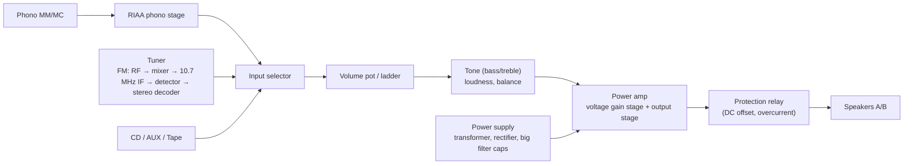

# Amplifiers & Receivers: 1960s – Now

> All brand and model names are **invented** (see the [fictional catalog](README.md#fictional-catalog)).

## 1. Terms

| Term | What it is |
|---|---|
| **Preamplifier** | input switching, volume, tone, phono stage; line level out (≈1 V) |
| **Power amplifier** | turns line level into speaker current/voltage |
| **Integrated amplifier** | pre + power in one box |
| **Tuner** | AM/FM (later DAB, internet radio) receiver |
| **Receiver** | tuner + preamp + power amp in one box |
| **A/V receiver (AVR)** | receiver with surround decoding, 5–11+ channels, video switching (HDMI) |
| **Streaming amp** | integrated amp with network streaming and DAC, often Class D |

## 2. History by decade

### 1960s: Tubes at their peak, transistors arrive
- **Vacuum-tube** amps dominate hi-fi: push-pull pentodes (EL34, 6L6, KT88) with output transformers,
  10–75 W per channel. Stand-ins: **Calder Tube 75** power amp (1961) and **Calder Pre-9** preamp (1962).
- **FM stereo multiplex** approved in the US in 1961 → stereo receivers become the centre of the system.
- **Germanium then silicon transistors**: early solid-state amps (mid-60s) had a harsh reputation from
  crossover distortion and poor design for transistor behaviour; by the late 60s silicon designs with
  lots of negative feedback beat tubes on measured distortion.
- **Baxandall tone control** (published 1952) becomes the standard tone circuit.
- Output-transformerless solid-state designs drive 4–16 Ω speakers directly.

### 1970s: The receiver wars
- Japanese brands compete on **power, silver faceplates, big tuning dials, analog meters**. Late-70s
  flagship receivers reach 250–300 W per channel. Stand-in: **Orbis R-270** (1978, 270 W/ch).
- **1974 FTC amplifier rule** (US) requires continuous (RMS) power across a stated bandwidth at stated
  THD, ending inflated "peak/music power" claims.
- **Quadraphonic** (1971–mid-70s) receivers: matrix and discrete four-channel systems that flopped.
- **Phase-locked loop** FM stereo decoders, then **quartz-synthesized digital tuning** (late 70s).
- **TIM (transient intermodulation)** debate drives lower-feedback and faster designs.
- Budget champion integrated amps with soft-clipping and modest power (stand-in: **Orbis I-30**, 1979,
  20 W/ch) prove you don't need a monster receiver.

### 1980s: Class A high end, remotes and the rise of surround
- High-end **class A** and high-current power amps for difficult loads. Stand-in: **Strand A-50** (1982,
  50 W/ch class A, doubles into 4 Ω).
- **MOSFET** output stages.
- **Remote controls**, motorised volume, digital displays, microprocessor-controlled tuners with presets.
- **Matrix surround decoding** (4 channels from 2, 1987 with active steering logic) appears in receivers.
- **CD input** standard; receivers lose phono stages later in the decade on budget models.

### 1990s: The A/V receiver takes over
- **Discrete 5.1 digital surround** codecs (home release ≈1995–96) put DSP decoders and 5–6 power amps in
  one box. Stand-in: **Vexa AVR-5** (1996, 5×100 W).
- **Digital inputs** (coax/optical S/PDIF), on-screen menus, room "DSP modes" (hall, stadium).
- Two-channel high end goes the other way: **minimalist integrated amps**, no tone controls.
- **Early Class D** for subwoofers and car audio; first audiophile-grade Class D modules (late 90s).
- **Single-ended triode** (SET) tube revival in hobbyist circles.

### 2000s: HDMI and auto-calibration
- **HDMI** (2003+) brings video switching and lossless surround (2006+, high-def disc formats).
- **7.1** channels, **automatic speaker setup** with a measurement microphone.
- **Network** features (internet radio, DLNA), then **USB DAC** inputs on stereo amps.
- **Class D** power modules good enough for hi-fi; first "direct digital" amps where PCM drives the
  output stage without a traditional DAC.

### 2010s – now: Streaming and object-based surround
- **Streaming amplifiers** (network + DAC + Class D in a small box). Stand-in: **Vexa D-100** (2021,
  2×100 W GaN Class D, HDMI eARC, room correction).
- **Object-based height channels** (2014+ at home) push AVRs to 9–13 channels. Stand-in: **Vexa AVR-9**
  (2016, 9.2 ch).
- **HDMI 2.1, 8K pass-through, eARC**, app control, voice assistant integration.
- **GaN (gallium-nitride) transistors** in Class D (2020s).
- Big retro trend: refurbished 70s receivers sell for more than their original prices.

## 3. Amplifier classes

| Class | Output device conduction | Efficiency (theoretical / typical) | Character |
|---|---|---|---|
| A | 360° (always on) | 25–50% / 15–25% | lowest crossover distortion, very hot |
| B | 180° each half | 78.5% / 50–60% | crossover distortion near zero crossing |
| AB | slightly > 180° (bias ≈ 20–100 mA) | ≈ B | default for 1970–2010 solid-state hi-fi |
| D | switching PWM at 300 kHz – 1+ MHz + LC filter | 90–95% | small, cool; output filter interacts with load |
| G / H | AB with switched / tracking supply rails | 60–80% | AVRs, pro audio |
| Tube push-pull (AB1) | two tubes into center-tapped output transformer | 30–50% | soft clipping, higher output impedance |

## 4. Fictional models to emulate

| Fictional model | Year | Type | Key specs (for emulation) |
|---|---|---|---|
| **Calder Tube 75** | 1961 | stereo tube power amp, push-pull KT88-type | 2×75 W, output transformer taps 4/8/16 Ω, damping factor ≈ 12, soft clip |
| **Calder Pre-9** | 1962 | tube preamp | phono RIAA, Baxandall tone, ≈ 0.2% THD, 12AX7-type stages |
| **Orbis R-270** | 1978 | flagship stereo receiver | 2×270 W into 8 Ω, 20 Hz–20 kHz, 0.03% THD, analog FM with quartz lock, twin power meters, 2 tape loops |
| **Orbis I-30** | 1979 | budget integrated | 2×20 W, soft-clipping circuit, high dynamic headroom, MM phono |
| **Strand A-50** | 1982 | class A stereo power amp | 2×50 W / 8 Ω, 2×100 W / 4 Ω, idle 350 W draw, DF > 200 |
| **Vexa AVR-5** | 1996 | 5.1 A/V receiver | 5×100 W (2 ch driven), 5.1 decoder, matrix surround, 6 DSP hall modes |
| **Vexa AVR-9** | 2016 | 9.2 A/V receiver | 9×110 W, HDMI 2.0, height channels, auto room calibration |
| **Vexa D-100** | 2021 | streaming Class D amp | 2×100 W GaN, 32-bit DAC, eARC, phono MM, room correction |

## 5. Typical failure modes (for realistic emulation)
- Dirty volume pots and switches → crackle, channel drop-out.
- Dried electrolytic capacitors → hum, reduced power, DC offset.
- Thermal runaway of output transistors when bias drifts → protection relay trips.
- Burnt-out dial lamps (70s receivers) — a famous restoration job.
- Tubes ageing → lower output, microphonics; output transformer saturation at low frequencies.

See [blueprints.md § Amplifiers](blueprints.md#3-amplifier--receiver-blueprints) and
[emulation-spec.md](emulation-spec.md#amplifier-module).
