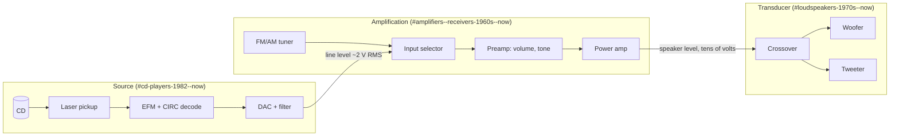
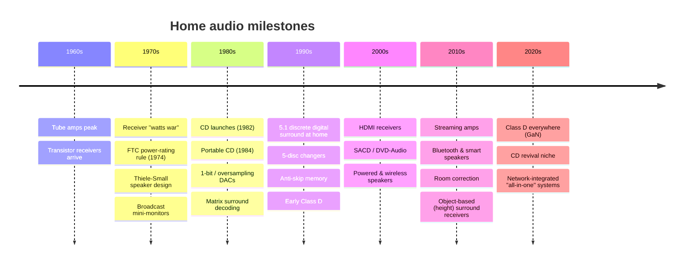
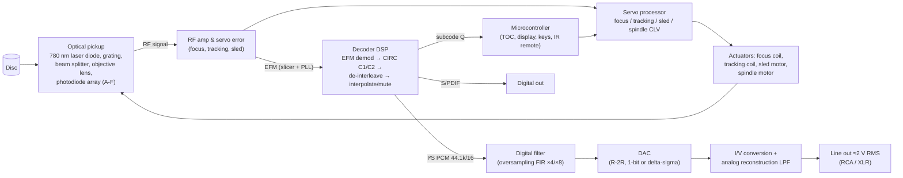
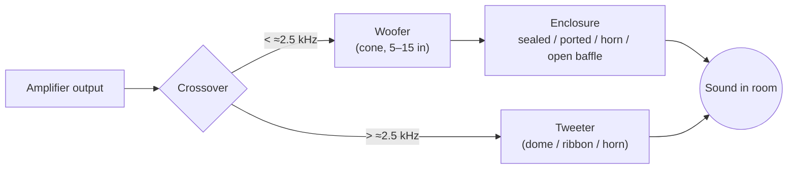
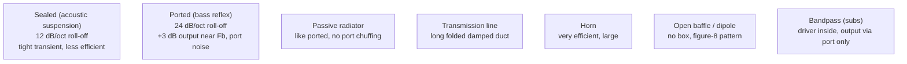
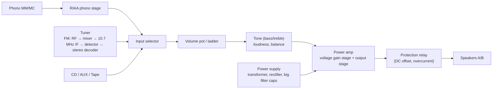
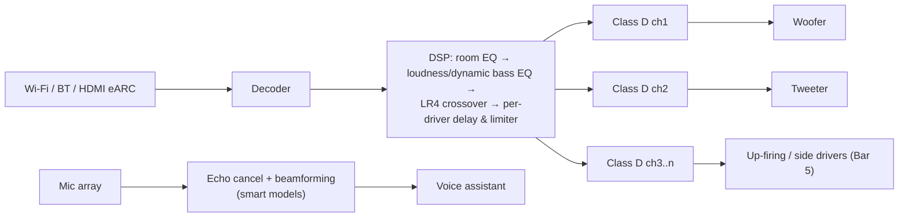
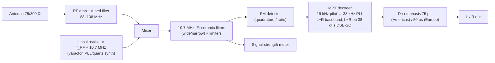
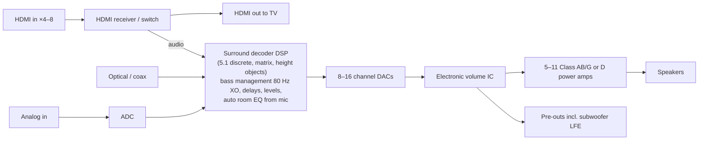
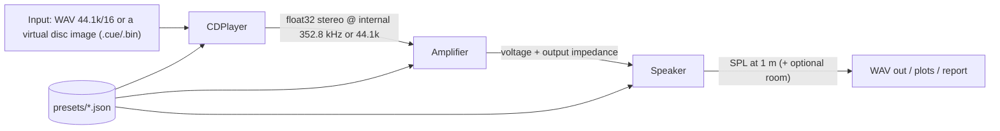

# Home Audio Research: CD Players, Speakers, Amplifiers & Receivers

A history, a technical breakdown and emulation-ready blueprints for three families of home audio gear.

| Section | Covers | Era |
|---|---|---|
| [cd-players.md](#cd-players-1982--now) | Compact Disc players, transports, DACs, portables, changers | 1982 – now |
| [speakers.md](#loudspeakers-1970s--now) | Passive and active loudspeakers, enclosures, drivers, crossovers | 1970s – now |
| [amplifiers-receivers.md](#amplifiers--receivers-1960s--now) | Tube, solid-state, Class D amps; stereo and A/V receivers; tuners | 1960s – now |
| [blueprints.md](#blueprints-reference-designs) | Generic reference designs: block diagrams, circuits, formulas, parameter tables, pseudo-code | All |
| [emulation-spec.md](#emulation-spec-hand-this-to-codex-or-another-coding-agent) | A software architecture and data schema for a coding agent (such as Codex) to build simulators of all three | All |

## How the three fit together



## Timeline at a glance



## Fictional catalog

**Every brand and model name in these documents is invented** so nothing copies a real trademark or
product. Each fictional model is a stand-in for a typical product of its era. Standards (Red Book,
S/PDIF, HDMI, Thiele-Small, RIAA) keep their real names because they are public technical specs.

| Fictional brand | Category | Models |
|---|---|---|
| Aurion | CD players | CDX-1 (1982 front loader), Pocket P-1 (1984 portable), P-10 ESP (1995 anti-skip portable) |
| Halden | CD players | CP-14 (1983 14-bit oversampling top loader), H-7 (2022 hi-fi player) |
| Veltro | CD players | BitStream B-1 (1990 1-bit), Carousel C-5 (1992 5-disc changer) |
| Meridale | CD transport + DAC | T-1 transport, D-1 DAC (1996) |
| Kestrel | Speakers | AS-10 (1972 acoustic suspension), M-3 (1976 mini-monitor), K-8 Coax (1990 coaxial) |
| Torva | Speakers | Horn H-1 (1975 horn-loaded), Studio N-10 (1980 near-field monitor), Tower T-5 (1985 floor-stander) |
| Lumen | Speakers | Planar P-1 (1981 electrostatic/planar) |
| Nimbus | Speakers | Pod 1 (2006 powered wireless), Echo S (2015 smart speaker), Bar 5 (2018 soundbar) |
| Calder | Amplifiers | Tube 75 (1961 tube power amp), Pre-9 (1962 tube preamp) |
| Orbis | Receivers / amps | R-270 (1978 "monster" receiver), I-30 (1979 budget integrated) |
| Strand | Amplifiers | A-50 (1982 class A power amp) |
| Vexa | Receivers / amps | AVR-5 (1996 5.1 A/V receiver), AVR-9 (2016 height-channel A/V receiver), D-100 (2021 Class D streaming amp) |

## Notes on accuracy

- Dates and figures describe what was typical in each era; where a figure is approximate it is marked "≈".
- The **blueprints are generic reference designs** that show how each category works. They are not copies
  of any manufacturer's service schematic. They are meant to be simulated, studied, or used as a starting
  point, with real component values you can compute from the formulas given.

---

# CD Players: 1982 – Now

## 1. The format in one table (Red Book, IEC 60908)

| Parameter | Value |
|---|---|
| Sample rate / resolution | 44.1 kHz, 16-bit linear PCM, 2 channels |
| Audio data rate | 1,411.2 kbit/s |
| Disc diameter / thickness | 120 mm (80 mm "single") / 1.2 mm polycarbonate |
| Track pitch | 1.6 µm, single spiral from inside out |
| Scanning speed | 1.2 – 1.4 m/s, Constant Linear Velocity (≈500 rpm at the hub → ≈200 rpm at the rim) |
| Laser | 780 nm infrared, objective NA 0.45 |
| Pit width / length | ≈0.5 µm wide, 0.83 – 3.05 µm long (3T – 11T) |
| Channel code | EFM (Eight-to-Fourteen Modulation) + 3 merging bits |
| Channel bit rate | 4.3218 Mbit/s |
| Error correction | CIRC (Cross-Interleaved Reed-Solomon Code), C1 (32,28) + C2 (28,24) |
| Frame | 588 channel bits = 24 audio bytes + 4 C2 parity + 4 C1 parity + 1 subcode byte + sync |
| Subcode | 8 channels P–W; Q carries track/index/time (TOC in lead-in) |
| Max playing time | 74 min (standard), 80 min (common later) |

## 2. History

> All brand and model names in this research are **invented** (see the [fictional catalog](#fictional-catalog)).
> The history describes what the industry did, not specific trademarked products.

### 1979–1982: Invention
- Two large electronics companies (one Dutch, one Japanese) jointly developed the format; the standard
  (Red Book) was finalized in 1980.
- **October 1982**: the first commercial player goes on sale in Japan. Our stand-in is the
  **Aurion CDX-1**: front-loading tray, non-oversampling 16-bit DAC, three-beam laser pickup.
- **Late 1982 / early 1983**: the European partner's first player, our **Halden CP-14**: top loader with a
  **single-beam swinging-arm** pickup, a **14-bit DAC** and a **4× oversampling digital filter**. Reaching
  CD-grade performance with 14 bits through oversampling was an early sign of where DAC design would go.

### 1983–1989: Growth and refinement
- Prices fell from ≈$900–1,000 to under $200 by the late 80s.
- **1984**: the first portable CD player, our **Aurion Pocket P-1**, roughly four CD cases stacked.
- Car CD players appear (1984).
- **Oversampling** (2×, 4×, 8×) became standard, letting designers replace steep "brick-wall" analog
  filters (with big phase shift) by gentle filters after a digital FIR filter.
- **Multi-bit R-2R DACs** went from 16 to 18 and then 20 bits; the best-trimmed parts are still prized.
- **1989: 1-bit DACs** (bitstream / multi-stage noise shaping) trade bit depth for very high rate and
  noise shaping and avoid R-2R linearity problems. Our stand-in: **Veltro BitStream B-1**.
- **Carousel and magazine changers** (5-disc carousels, 6-disc magazines): our **Veltro Carousel C-5**.
- **CD-R** standard (Orange Book) in 1988; affordable consumer CD-R recording in the 90s.

### 1990s: Mass market and high end diverge
- **Anti-skip / electronic shock protection**: portables buffer 3–10 s (later 40+ s with compression)
  of audio in DRAM so playback continues while the servo re-finds the track.
- **Separate transports + DACs** rise in high-end hi-fi, our **Meridale T-1 transport + D-1 DAC**. The
  link is **S/PDIF** (coax 75 Ω or optical) or AES/EBU (110 Ω balanced). Jitter becomes a major topic.
- LSB-embedded "extra resolution" encodings appear (1995).
- **Mega-changers**: 100–400 disc jukeboxes.
- **CD-RW** (1997) and players that read CD-R/RW.

### 2000s: Formats multiply, CD players shrink in importance
- **SACD** (1999, DSD 1-bit at 2.8224 MHz) and **DVD-Audio** (2000, up to 24/192) as successors;
  neither replaced CD.
- **MP3/WMA CD playback** in portables and car units (~2000+), then hard-drive and flash music players
  erode CD use.
- DVD and then Blu-ray "universal players" absorb CD playback.
- DAC chips move almost entirely to multi-level delta-sigma designs.

### 2010s – now: Niche, revival, and the transport-plus-DAC model
- Streaming takes over; many brands stop making CD players.
- Remaining players are mostly hi-fi models or **transports** feeding external DACs, some with USB DAC
  inputs and streaming built in. Our stand-in: **Halden H-7**.
- A major DAC-chip factory fire in **October 2020** forced many products to switch DAC suppliers.
- Renewed interest in physical media since the early 2020s: CD sales stabilised and in some markets grew
  modestly. Ripping to lossless (FLAC/ALAC) is a common "CD-as-source" workflow.

## 3. How a CD player works



### Optical pickup
- **Three-beam** (most mass-market players): a diffraction grating splits the beam; two side spots measure
  tracking error (E − F), the main spot reads data on a 4-quadrant photodiode (A+B+C+D = RF) and focus
  error via an astigmatic lens ((A+C) − (B+D)).
- **Single-beam swing arm**: a rotary arm moves radially; tracking error comes from
  the main spot (push-pull). Admired for robustness and tracking.
- Two mechanism styles: linear sled (worm gear or linear motor) and rotary swing arm.

### Servos (four control loops)
| Loop | Sensor | Actuator | Notes |
|---|---|---|---|
| Focus | astigmatic focus error | voice-coil in lens | keeps spot within ≈±1 µm depth of field |
| Tracking | three-beam or push-pull error | lens tracking coil | follows ±70 µm eccentricity |
| Sled | DC component of tracking drive | sled motor / worm gear | moves the whole pickup slowly |
| Spindle (CLV) | EFM frame rate vs crystal | spindle motor | keeps channel bit rate at 4.3218 MHz |

### Decoding chain
1. **Slicer + PLL** turn the analog RF eye pattern into a channel bit clock and bits.
2. **Sync detection** finds the 24-bit frame sync (11T + 11T pattern).
3. **EFM demodulation**: lookup table from 14-bit symbols to 8-bit bytes (256 valid of 16,384).
4. **C1 decoder**: RS(32,28) corrects up to 2 symbol errors per frame (often configured to correct 1 and
   flag 2+).
5. **De-interleave**: up to 108 frames of delay spreads burst errors (scratches) across many C2 words.
6. **C2 decoder**: RS(28,24) corrects remaining errors using C1 erasure flags.
7. **Concealment**: if uncorrectable, **interpolate** between neighbours or **mute**. CIRC can correct
   bursts of ≈3,500 bits (≈2.4 mm of track) and conceal ≈12,000 bits (≈8.5 mm).

### Digital-to-analog conversion
| DAC type | Era | How it works | Examples |
|---|---|---|---|
| Multibit R-2R / current-segment | 1982–90s, revived in boutique DACs | weighted current sources summed into I/V stage | 14–20 bit, laser-trimmed MSBs |
| 1-bit / bitstream / multi-stage noise shaping | 1989–late 90s | very high rate 1-bit stream, noise-shaped, with switched-capacitor filter | 1-bit at 128–256× fs |
| Multi-level delta-sigma | mid-90s – now | 3–6 bit modulator at 64–256× fs, dynamic element matching | 24–32 bit input, 120–130 dB DNR |

## 4. Fictional models to emulate

| Fictional model | Archetype | Distinguishing behaviour to emulate |
|---|---|---|
| **Aurion CDX-1** (1982) | first-gen front loader | non-oversampling 16-bit DAC with steep analog filter (phase shift near 20 kHz), slow track access |
| **Halden CP-14** (1983) | first-gen top loader | 14-bit DAC + 4× oversampling, swing arm |
| **Aurion Pocket P-1** (1984) / **P-10 ESP** (1995) | portable | battery, ESP buffer, skip behaviour |
| **Veltro BitStream B-1** (1990) | 1-bit era | noise-shaped 1-bit DAC, rising HF noise floor above 20 kHz |
| **Veltro Carousel C-5** (1992) | 5-disc changer | disc selection, random play across discs, load time |
| **Meridale T-1 + D-1** (1996) | high-end split | S/PDIF link, jitter, upsampling filters |
| **Halden H-7** (2022) | modern hi-fi | delta-sigma DAC, selectable filters, USB input |

## 5. Failure modes (useful for realistic emulation)
- Laser diode ageing → lower RF amplitude → more C1/C2 errors → skips/mutes on CD-R first.
- Dried grease on sled rails → sled sticks, long seeks.
- Belt-driven trays slip (very common on 80s/90s units).
- Spindle motor wear → CLV hunting at disc start.
- Leaking capacitors in power supply → hum, random resets.

See [blueprints.md § CD player](#1-cd-player-blueprint) for the reference design and
[emulation-spec.md](#cd-player-module) for the software model.

---

# Loudspeakers: 1970s – Now

> All brand and model names are **invented** (see the [fictional catalog](#fictional-catalog)).

## 1. Core concepts

A loudspeaker turns the amplifier's voltage into air movement. A **driver** (voice coil in a magnet gap,
attached to a cone or dome) moves air. The **enclosure** controls the back wave, and the **crossover**
sends each frequency band to the right driver.



### Anatomy of a moving-coil driver

```
           ┌──── frame (basket)
   surround│  ╭───────── cone / diaphragm ─────────╮
     ╭─────┤ ╱                                      ╲
     │     │╱        dust cap ╭──╮                   ╲
     │     │                  │  │  ← voice coil former
     │  spider (suspension) ══╪══╪══
     │     │      ┌───────────┴──┴───────────┐
     │     │      │ top plate  ║ coil ║ gap  │  ← magnet (ferrite, alnico or neodymium)
     │     │      │  MAGNET    ║      ║      │
     │     │      └──── pole piece / back plate
```

### Thiele-Small (T/S) parameters
Published in the early 1970s (Thiele 1961/1971; Small 1972–73), these turned box design into
engineering. They are what you need to emulate a driver:

| Symbol | Meaning | Typical 8-in woofer |
|---|---|---|
| Fs | free-air resonance | 30–45 Hz |
| Qts | total Q (Qes ‖ Qms) | 0.3–0.5 |
| Vas | air volume with the same compliance as the suspension | 30–60 L |
| Re | voice-coil DC resistance | 5.5–6.5 Ω |
| Le | voice-coil inductance | 0.5–1.5 mH |
| Bl | force factor | 6–10 T·m |
| Mms | moving mass | 20–40 g |
| Sd | cone area | ≈220 cm² |
| Xmax | linear excursion | 4–8 mm |
| η0 / sensitivity | efficiency | 86–90 dB SPL at 2.83 V / 1 m |

## 2. History by decade

### 1970s: Bookshelf boom, horns, and the science of the box
- **Acoustic suspension** (sealed box, invented in the 1950s) dominates mass-market bookshelf speakers:
  deep bass from a small box at the cost of efficiency. Stand-in: **Kestrel AS-10** (1972).
- **Bass reflex** comes back once Thiele-Small alignments make ports predictable.
- **Horn-loaded** and high-efficiency designs (100+ dB/W) suit the low-power tube amps still around, and
  are big in pro sound. Stand-in: **Torva Horn H-1** (1975).
- **Broadcaster mini-monitors** (1975): tiny sealed two-way boxes designed for near-field monitoring in
  outside-broadcast vans, famous for midrange accuracy. Stand-in: **Kestrel M-3** (1976).
- **Ferrofluid** in tweeter gaps for cooling and damping.
- **Direct/reflecting** speakers bounce most of the sound off the wall behind.
- Disco and rock push **big three-way floor-standers** with 12–15 in woofers.

### 1980s: New materials, monitors and the audiophile high end
- **Polypropylene cones** (late 70s/80s), metal-dome tweeters (aluminium, titanium).
- **Neodymium magnets** (mid-80s) shrink drivers.
- **Near-field studio monitors** with a white paper woofer become the mixing standard (1978–80s).
  Stand-in: **Torva Studio N-10** (1980).
- **Electrostatic and planar-magnetic** panels: very low-mass diaphragms, dipole radiation.
  Stand-in: **Lumen Planar P-1** (1981).
- **Time-aligned / sloped baffles** and **modular high-end towers** (late 80s) aim at phase coherence.
- Floor-standing **towers** with multiple woofers: **Torva Tower T-5** (1985).
- **Linkwitz-Riley crossovers** (published 1976) become the standard for flat summed response.
- **Point-source coaxial drivers** (tweeter in the woofer's centre), stand-in **Kestrel K-8 Coax** (1990).

### 1990s: Home theater and computer-aided design
- 5.1 home theater creates **satellite + subwoofer** systems, **centre channels** and **powered subs**
  with built-in plate amps.
- **Laser interferometry and Klippel-style measurement**, FEA and CAD make driver design much faster.
- **Shielded** drivers for use next to CRT TVs.
- Exotic tweeter materials: beryllium, diamond (CVD), ceramic.

### 2000s: Powered, wireless, small
- **Powered speakers** (amp + active crossover inside) for desktops and studios.
- **Multi-room wireless** speakers (mid-2000s), stand-in: **Nimbus Pod 1** (2006).
- **Line arrays** in pro audio, **in-wall/in-ceiling** custom installs at home.

### 2010s: Bluetooth, smart and DSP-everything
- Portable **Bluetooth speakers** (2010+).
- **Smart speakers** with far-field microphones and voice assistants (2014+). Stand-in: **Nimbus Echo S**.
- **Soundbars** with virtual surround and upward-firing drivers. Stand-in: **Nimbus Bar 5** (2018).
- **Automatic room correction** using the device's microphone or a phone.
- **Active "wireless hi-fi"** bookshelf speakers with built-in DAC, streaming and Class D amps.

### 2020s
- **DSP-corrected compact speakers** with tiny long-throw woofers + passive radiators.
- **Spatial audio / height channels** and beam-steering arrays.
- **GaN Class D** in active speakers; sustainability (repairable modules, recycled cones).
- Vintage speaker restoration (re-foaming surrounds, recapping crossovers) is a strong hobby.

## 3. Enclosure types compared



| Type | Box size for 8-in woofer | F3 (≈) | Sensitivity | Best for |
|---|---|---|---|---|
| Sealed (Qtc 0.707) | 20–40 L | 50–60 Hz | 86–88 dB | accuracy, room gain |
| Ported (QB3/B4) | 30–50 L | 35–45 Hz | 87–89 dB | bass extension |
| Horn (bass) | 200+ L | 40 Hz | 95–105 dB | low-power amps, PA |
| Open baffle | flat panel | 60+ Hz | 85 dB | spacious imaging |

## 4. Crossover basics
- **First-order** (6 dB/oct): one cap for tweeter, one inductor for woofer; phase coherent, lots of overlap.
- **Second-order** (12 dB/oct): tweeter wired in reverse polarity for Butterworth; LR2 needs this too.
- **Fourth-order Linkwitz-Riley** (24 dB/oct): flat sum, drivers in phase; standard in active designs.
- **Zobel** (series R + C across woofer) flattens rising voice-coil impedance; **L-pad** attenuates the
  tweeter to match sensitivity.
- Active / DSP crossovers (2000s+) add delay and EQ per driver.

## 5. Fictional models to emulate

| Fictional model | Year | Type | Key specs (for emulation) |
|---|---|---|---|
| **Kestrel AS-10** | 1972 | 2-way sealed bookshelf, 10-in woofer | 40 L, Qtc 0.7, F3 45 Hz, 86 dB, 8 Ω, 1st-order XO @ 1.5 kHz |
| **Torva Horn H-1** | 1975 | 3-way corner horn | 103 dB, F3 40 Hz, compression mid/tweeter horns |
| **Kestrel M-3** | 1976 | 2-way mini monitor, 5-in + 0.75-in dome | 5 L sealed, F3 80 Hz, 83 dB, 15 Ω, bumped mid-bass |
| **Torva Studio N-10** | 1980 | near-field monitor, 7-in + 1-in dome | 12 L sealed, F3 60 Hz, 90 dB, mid-range forward peak ≈1.5–2 kHz |
| **Lumen Planar P-1** | 1981 | full-range electrostatic dipole | 85 dB, impedance 2–30 Ω, step-up transformer, needs 230 V bias |
| **Torva Tower T-5** | 1985 | 3-way ported floorstander, 2×8-in + 5-in + 1-in | 70 L, Fb 32 Hz, 90 dB, LR4 XO @ 400 Hz / 3 kHz |
| **Kestrel K-8 Coax** | 1990 | 2-way coaxial, 6.5-in with central tweeter | 9 L ported, 87 dB, point-source dispersion |
| **Nimbus Pod 1** | 2006 | powered wireless 2-way | 2×25 W Class D, DSP XO, bass EQ boost |
| **Nimbus Echo S** | 2015 | smart speaker, 360° | 2.5-in woofer + 0.6-in tweeter, 7 mics, DSP loudness |
| **Nimbus Bar 5** | 2018 | 5.0.2 soundbar | up-firing drivers, beam forming, virtual surround |

See [blueprints.md § Speakers](#2-loudspeaker-blueprints) and
[emulation-spec.md](#speaker-module).

---

# Amplifiers & Receivers: 1960s – Now

> All brand and model names are **invented** (see the [fictional catalog](#fictional-catalog)).

## 1. Terms

| Term | What it is |
|---|---|
| **Preamplifier** | input switching, volume, tone, phono stage; line level out (≈1 V) |
| **Power amplifier** | turns line level into speaker current/voltage |
| **Integrated amplifier** | pre + power in one box |
| **Tuner** | AM/FM (later DAB, internet radio) receiver |
| **Receiver** | tuner + preamp + power amp in one box |
| **A/V receiver (AVR)** | receiver with surround decoding, 5–11+ channels, video switching (HDMI) |
| **Streaming amp** | integrated amp with network streaming and DAC, often Class D |



## 2. History by decade

### 1960s: Tubes at their peak, transistors arrive
- **Vacuum-tube** amps dominate hi-fi: push-pull pentodes (EL34, 6L6, KT88) with output transformers,
  10–75 W per channel. Stand-ins: **Calder Tube 75** power amp (1961) and **Calder Pre-9** preamp (1962).
- **FM stereo multiplex** approved in the US in 1961 → stereo receivers become the centre of the system.
- **Germanium then silicon transistors**: early solid-state amps (mid-60s) had a harsh reputation from
  crossover distortion and poor design for transistor behaviour; by the late 60s silicon designs with
  lots of negative feedback beat tubes on measured distortion.
- **Baxandall tone control** (published 1952) becomes the standard tone circuit.
- Output-transformerless solid-state designs drive 4–16 Ω speakers directly.

### 1970s: The receiver wars
- Japanese brands compete on **power, silver faceplates, big tuning dials, analog meters**. Late-70s
  flagship receivers reach 250–300 W per channel. Stand-in: **Orbis R-270** (1978, 270 W/ch).
- **1974 FTC amplifier rule** (US) requires continuous (RMS) power across a stated bandwidth at stated
  THD, ending inflated "peak/music power" claims.
- **Quadraphonic** (1971–mid-70s) receivers: matrix and discrete four-channel systems that flopped.
- **Phase-locked loop** FM stereo decoders, then **quartz-synthesized digital tuning** (late 70s).
- **TIM (transient intermodulation)** debate drives lower-feedback and faster designs.
- Budget champion integrated amps with soft-clipping and modest power (stand-in: **Orbis I-30**, 1979,
  20 W/ch) prove you don't need a monster receiver.

### 1980s: Class A high end, remotes and the rise of surround
- High-end **class A** and high-current power amps for difficult loads. Stand-in: **Strand A-50** (1982,
  50 W/ch class A, doubles into 4 Ω).
- **MOSFET** output stages.
- **Remote controls**, motorised volume, digital displays, microprocessor-controlled tuners with presets.
- **Matrix surround decoding** (4 channels from 2, 1987 with active steering logic) appears in receivers.
- **CD input** standard; receivers lose phono stages later in the decade on budget models.

### 1990s: The A/V receiver takes over
- **Discrete 5.1 digital surround** codecs (home release ≈1995–96) put DSP decoders and 5–6 power amps in
  one box. Stand-in: **Vexa AVR-5** (1996, 5×100 W).
- **Digital inputs** (coax/optical S/PDIF), on-screen menus, room "DSP modes" (hall, stadium).
- Two-channel high end goes the other way: **minimalist integrated amps**, no tone controls.
- **Early Class D** for subwoofers and car audio; first audiophile-grade Class D modules (late 90s).
- **Single-ended triode** (SET) tube revival in hobbyist circles.

### 2000s: HDMI and auto-calibration
- **HDMI** (2003+) brings video switching and lossless surround (2006+, high-def disc formats).
- **7.1** channels, **automatic speaker setup** with a measurement microphone.
- **Network** features (internet radio, DLNA), then **USB DAC** inputs on stereo amps.
- **Class D** power modules good enough for hi-fi; first "direct digital" amps where PCM drives the
  output stage without a traditional DAC.

### 2010s – now: Streaming and object-based surround
- **Streaming amplifiers** (network + DAC + Class D in a small box). Stand-in: **Vexa D-100** (2021,
  2×100 W GaN Class D, HDMI eARC, room correction).
- **Object-based height channels** (2014+ at home) push AVRs to 9–13 channels. Stand-in: **Vexa AVR-9**
  (2016, 9.2 ch).
- **HDMI 2.1, 8K pass-through, eARC**, app control, voice assistant integration.
- **GaN (gallium-nitride) transistors** in Class D (2020s).
- Big retro trend: refurbished 70s receivers sell for more than their original prices.

## 3. Amplifier classes

| Class | Output device conduction | Efficiency (theoretical / typical) | Character |
|---|---|---|---|
| A | 360° (always on) | 25–50% / 15–25% | lowest crossover distortion, very hot |
| B | 180° each half | 78.5% / 50–60% | crossover distortion near zero crossing |
| AB | slightly > 180° (bias ≈ 20–100 mA) | ≈ B | default for 1970–2010 solid-state hi-fi |
| D | switching PWM at 300 kHz – 1+ MHz + LC filter | 90–95% | small, cool; output filter interacts with load |
| G / H | AB with switched / tracking supply rails | 60–80% | AVRs, pro audio |
| Tube push-pull (AB1) | two tubes into center-tapped output transformer | 30–50% | soft clipping, higher output impedance |

## 4. Fictional models to emulate

| Fictional model | Year | Type | Key specs (for emulation) |
|---|---|---|---|
| **Calder Tube 75** | 1961 | stereo tube power amp, push-pull KT88-type | 2×75 W, output transformer taps 4/8/16 Ω, damping factor ≈ 12, soft clip |
| **Calder Pre-9** | 1962 | tube preamp | phono RIAA, Baxandall tone, ≈ 0.2% THD, 12AX7-type stages |
| **Orbis R-270** | 1978 | flagship stereo receiver | 2×270 W into 8 Ω, 20 Hz–20 kHz, 0.03% THD, analog FM with quartz lock, twin power meters, 2 tape loops |
| **Orbis I-30** | 1979 | budget integrated | 2×20 W, soft-clipping circuit, high dynamic headroom, MM phono |
| **Strand A-50** | 1982 | class A stereo power amp | 2×50 W / 8 Ω, 2×100 W / 4 Ω, idle 350 W draw, DF > 200 |
| **Vexa AVR-5** | 1996 | 5.1 A/V receiver | 5×100 W (2 ch driven), 5.1 decoder, matrix surround, 6 DSP hall modes |
| **Vexa AVR-9** | 2016 | 9.2 A/V receiver | 9×110 W, HDMI 2.0, height channels, auto room calibration |
| **Vexa D-100** | 2021 | streaming Class D amp | 2×100 W GaN, 32-bit DAC, eARC, phono MM, room correction |

## 5. Typical failure modes (for realistic emulation)
- Dirty volume pots and switches → crackle, channel drop-out.
- Dried electrolytic capacitors → hum, reduced power, DC offset.
- Thermal runaway of output transistors when bias drifts → protection relay trips.
- Burnt-out dial lamps (70s receivers) — a famous restoration job.
- Tubes ageing → lower output, microphonics; output transformer saturation at low frequencies.

See [blueprints.md § Amplifiers](#3-amplifier--receiver-blueprints) and
[emulation-spec.md](#amplifier-module).

---

# Blueprints: Reference Designs

> **Generic reference designs**, not copies of any manufacturer's schematic. All model names are invented
> (see the [fictional catalog](#fictional-catalog)). Component values are computed from the
> formulas shown so you can change them. Mains-powered builds are dangerous: tube amps hold 300–500 V DC
> and electrostatic speakers several kV. Simulate first (SPICE, Python), build only with proper training.

---

## 1. CD player blueprint

### 1.1 System block diagram (fits Aurion CDX-1 through Halden H-7)

```
 ┌──────────────────────────── MECHANISM ─────────────────────────────┐
 │  Spindle motor ◄── CLV drive        Sled motor ◄── sled drive      │
 │       │                                  │                         │
 │   [ DISC ]  ◄── laser spot ── [ OPTICAL PICKUP ]                   │
 │                     focus coil ◄┤  ├► tracking coil                │
 │                                 │                                  │
 └─────────────────────────────────┼──────────────────────────────────┘
                     A,B,C,D,E,F photodiode currents
                                   ▼
 ┌─────────── RF / SERVO ──────────┐      ┌──────── CONTROL ──────────┐
 │ RF = A+B+C+D                    │◄────►│ Microcontroller           │
 │ FE = (A+C) − (B+D)  → focus PID │      │  TOC, seek, keys, display │
 │ TE = E − F          → track PID │      │  IR remote, tray motor    │
 │ sled = LPF(track drive)         │      └────────────▲──────────────┘
 └───────────────┬─────────────────┘                   │ subcode Q
                 │ RF eye → slicer → PLL (4.3218 MHz)  │
                 ▼                                     │
 ┌──────────────── DECODER DSP ────────────────────────┴─────────────┐
 │ sync detect → EFM demod (14→8) → C1 RS(32,28) → de-interleave     │
 │ (D* delays, up to 108 frames) → C2 RS(28,24) → interpolate/mute   │
 │ CLV error → spindle      16 KB RAM (FIFO absorbs speed wobble)    │
 └───────────────┬───────────────────────────────────────────────────┘
                 │ I²S: BCK 2.8224 MHz, LRCK 44.1 kHz, DATA
                 ▼
 ┌── DIGITAL FILTER ──┐   ┌──── DAC ────┐   ┌──── ANALOG OUT ────────────┐
 │ 4×/8× FIR, de-emph │──►│ R-2R / ΔΣ   │──►│ I/V op-amp → 2nd/3rd order │──► RCA 2 V RMS
 │ (50/15 µs flag)    │   │             │   │ LPF → mute relay → buffer  │
 └────────────────────┘   └─────────────┘   └────────────────────────────┘
                 └──────────► S/PDIF transmitter (biphase-mark) ──► coax 75 Ω / optical
```

### 1.2 Key numbers
| Signal | Value |
|---|---|
| Channel bit clock | 4.3218 MHz = 7,350 frames/s × 588 bits |
| Frames per second | 7,350 (98 frames = 1 subcode block = 1/75 s "sector") |
| Audio per frame | 6 stereo samples (24 bytes) |
| Master clock | 16.9344 MHz (384 fs) or 11.2896 MHz (256 fs) |
| Pre-emphasis | 50 µs / 15 µs shelf; flagged in subcode, undone in the filter or analog stage |

### 1.3 Variant differences
| Fictional model | Pickup | Filter | DAC | Analog filter | Extra |
|---|---|---|---|---|---|
| Aurion CDX-1 | three-beam linear sled | none (1×) | 16-bit R-2R, one DAC multiplexed L/R (≈11 µs inter-channel delay) | 9th-order passive brick wall @ 20 kHz | — |
| Halden CP-14 | swing arm | 4× FIR + noise shaping | 14-bit dual DAC | 3rd-order Bessel | — |
| Aurion Pocket P-1 | three-beam, compact | 2× | 16-bit | 2nd-order | battery 6 V, headphone amp |
| Aurion P-10 ESP | three-beam | 8× | 1-bit | switched-cap | 4 Mbit DRAM buffer (≈3 s) |
| Veltro BitStream B-1 | three-beam | 8× + 256× noise shaper | 1-bit PDM | 3rd-order | — |
| Veltro Carousel C-5 | three-beam | 8× | 18-bit R-2R | 3rd-order | 5-disc turntable tray |
| Meridale T-1 / D-1 | swing arm / — | — / 8× custom long FIR | — / 20-bit multibit | — / 2nd-order | S/PDIF + AES, PLL re-clock |
| Halden H-7 | three-beam | selectable (sharp, slow, minimum-phase) | 32-bit ΔΣ | 3rd-order | USB-B input, balanced out |

### 1.4 Analog reconstruction filter (after an 8× oversampling DAC)
A 3rd-order Sallen-Key + RC low-pass, Butterworth, fc ≈ 50 kHz:

```
 DAC I/V out ──R1 2.2k──┬──R2 2.2k──┬────────┐
                        │           │       ┌┴┐ op-amp (unity gain)
                       C1          C2       │+├──┬──R3 1k──┬── OUT
                       2.2n        1.0n        └┬┘  │        C3 3.3n
                     (to output)             └───┘         ↓ GND
```
Values: Sallen-Key 2nd-order fc = 1/(2π√(R1R2C1C2)) ≈ 49 kHz (C1 ≈ 2·C2 gives Q ≈ 0.707); final RC pole
fc = 1/(2πR3C3) ≈ 48 kHz. C2 goes to ground, C1 back to the op-amp output.
Non-oversampling designs (CDX-1) instead need ≥ 60 dB attenuation by 24.1 kHz, which takes a 7–11th
order elliptic filter.

---

## 2. Loudspeaker blueprints

### 2.1 Driver electro-mechanical model (for simulation)

```
   Electrical         Mechanical (via Bl transformer)      Acoustic
  ┌─Re─Le─┐          ┌───Mms───Rms───Cms───┐              radiation
 V│       ├── Bl ────┤                     ├── Sd ── box compliance / port
  └───────┘          └─────────────────────┘
```
Input impedance:
`Z(ω) = Re + jωLe + Bl² / ( jωMms + Rms + 1/(jωCms) + Zbox(ω) )`
Cone velocity → far-field SPL ≈ `ρ0 · Sd · |a(ω)| / (2π r)` where a is cone acceleration.
Parameter conversions: `Cms = Vas / (ρ0 c² Sd²)`, `Fs = 1/(2π√(Mms·Cms))`, `Qes = 2πFs·Mms·Re / Bl²`.

### 2.2 Sealed box design (Kestrel AS-10, Kestrel M-3)
- `Qtc = Qts · √(1 + Vas/Vb)`
- `Vb = Vas / ((Qtc/Qts)² − 1)`
- `fc = Fs · Qtc / Qts`; for Qtc = 0.707, F3 = fc
- Worked example: Fs 25 Hz, Qts 0.35, Vas 80 L, target Qtc 0.707 → Vb = 80 / (4.08 − 1) ≈ **26 L**,
  fc ≈ **50 Hz**.

### 2.3 Ported box design (Torva Tower T-5, Kestrel K-8 Coax)
Empirical QB3-style alignment (for Qts ≈ 0.25–0.45):
- `Vb ≈ 15 · Qts^2.87 · Vas`
- `Fb ≈ 0.42 · Fs · Qts^−0.9`
- `F3 ≈ 0.26 · Qts^−1.4 · Fs`
- Port length (cm): `Lv = 23562.5 · Dv² · Np / (Fb² · Vb) − 0.732 · Dv` (Dv port diameter cm, Vb litres,
  Np number of ports)
- Worked example: Fs 32 Hz, Qts 0.38, Vas 45 L → Vb ≈ 42 L, Fb ≈ 32 Hz, F3 ≈ 32 Hz; one 7 cm port →
  Lv ≈ 23562.5·49 / (1024·42) − 5.1 ≈ **21.7 cm**.

### 2.4 Cabinet blueprint (Torva Tower T-5, 70 L net, ported 3-way)

```
   FRONT                    SIDE (section)
 ┌──────────┐            ┌──────────┐
 │   (o)    │ tweeter    │▒ sealed  │ ← mid sub-chamber 4 L, stuffed
 │  ( O )   │ 5" mid     │▒ chamber │
 │──────────│            │──────────│ ← 18 mm divider
 │  (  O  ) │ 8" woofer  │          │
 │          │            │  70 L    │   bracing every ≈25 cm
 │  (  O  ) │ 8" woofer  │  ported  │   lining: 25 mm foam/wool on walls
 │          │            │          │
 │   ( = )  │ port 7 cm  │ ══port══ │   port ≈22 cm long
 └──────────┘            └──────────┘
  W 250 × H 1050 × D 340 mm external, 18–25 mm MDF, baffle edges rounded R 15 mm
```

### 2.5 Passive crossover (two-way, 8 Ω, fc = 2.5 kHz)

Second-order Linkwitz-Riley (LR2):

```
 AMP + ──┬──── L1 1.0 mH ────┬────────────── WOOFER +
         │                   C2 4.0 µF
         │                   │
         │                  GND (AMP −) ──── WOOFER −
         │
         └──── C1 4.0 µF ────┬──── Rs ──┬─── TWEETER −  (reversed polarity for LR2)
                             L2 1.0 mH  Rp
                             │          │
                            GND ────────┴─── TWEETER +
```
Formulas (R = nominal impedance, f = crossover frequency):

| Type | Capacitor | Inductor | Tweeter polarity |
|---|---|---|---|
| 1st order | C = 1/(2πfR) = 7.96 µF | L = R/(2πf) = 0.51 mH | normal |
| 2nd Butterworth | C = 0.1125/(Rf) = 5.63 µF | L = 0.2251R/f = 0.72 mH | reversed |
| LR2 | C = 0.0796/(Rf) = 3.98 µF | L = 0.3183R/f = 1.02 mH | reversed |

- **L-pad** for A dB attenuation into Z: `Rs = Z(1 − 10^(−A/20))`, `Rp = Z·10^(−A/20) / (1 − 10^(−A/20))`.
  For 3 dB at 8 Ω: Rs ≈ 2.3 Ω, Rp ≈ 19.4 Ω.
- **Zobel** across the woofer: `Rz = 1.25·Re`, `Cz = Le / Rz²` (Re 6 Ω, Le 0.8 mH → 7.5 Ω, 14 µF).

### 2.6 Active / DSP speaker (Nimbus Pod 1, Nimbus Echo S, Nimbus Bar 5)


Excursion limiter: predict cone excursion from the T/S model in real time and reduce low bass when
`x > 0.9·Xmax`.

### 2.7 Electrostatic panel (Lumen Planar P-1)
```
   stator (−HV signal) ════════════════════  perforated metal, ≈2 mm gap
   diaphragm (+bias 5 kV, high R coating)  ─ ─ ─ 12 µm mylar
   stator (+HV signal) ════════════════════
   audio in → step-up transformer 1:50..1:100 → stators;  bias supply from mains via multiplier
```
Force is linear because the charge on the diaphragm stays constant (high-resistance coating).

---

## 3. Amplifier & receiver blueprints

### 3.1 Class AB solid-state power amp (Orbis R-270 / Orbis I-30 / Vexa AVR channels)

```
                      +Vcc (±45 V for 100 W/8 Ω; ±75 V for 270 W/8 Ω)
                        │
          ┌─────────────┼───────────────┬───────────────┐
          │      current mirror        R_vas_load    Q_drv_N ── Q_out_N (NPN)
 IN ─C─R─►Q1 ┐                          │ (CCS)          │        │
          │  ├ diff pair  ──► VAS (Q_vas, Miller C 100 pF)│     Re 0.22 Ω
 FB ─────►Q2 ┘                          │                 │        ├────┬── L 2 µH ‖ 10 Ω ──► SPEAKER
          │      tail CCS 2 mA      Vbe multiplier        │     Re 0.22 Ω  │
          │                         (bias, on heatsink)  Q_drv_P ── Q_out_P (PNP)
          │                             │                 │       Zobel 10 Ω + 100 nF
          └─────────────────────────────┴─────────────────┘        │
                        │                                         GND
                      −Vcc
 Feedback: output → Rf 22 kΩ → Q2 base; Q2 base → Rg 1 kΩ + Cg 100 µF → GND   Gain = 1 + Rf/Rg ≈ 23 (27 dB)
```
Design rules:
- Rail voltage: `Vpk = √(2·P·R)`, rails ≈ Vpk + 5 V (100 W/8 Ω → 40 V peak → ±45 V).
- Bias: 20–60 mA per output pair (Vbe multiplier sets ≈ 2.4–2.8 V across the drivers); class A
  (Strand A-50) sets bias ≥ peak load current/2, ≈ 1.5–2 A per channel.
- Output pairs: one per ≈ 50–80 W into 8 Ω; 270 W receivers use 3 pairs.
- Protection: DC-offset detector (> ±1 V) + overcurrent sense on Re → opens speaker relay.

### 3.2 Linear power supply
```
 MAINS ─ fuse ─ switch ─ soft-start ─ toroid (2×32 V AC for ±45 V) ─ bridge 35 A ─┬─ 2×10,000 µF ─ +Vcc
                                                                                └─ 2×10,000 µF ─ −Vcc
 Separate small winding → 7815/7915 regulators → preamp/tuner ±15 V
```
Rule of thumb: ≈ 2,000–5,000 µF per ampere of peak load current per rail.

### 3.3 Baxandall tone control (Calder Pre-9, Orbis R-270)
```
            ┌── C1 47n ──┬── C1' 47n ──┐
            │            │             │
 IN ── R1 10k ── BASS POT 100k lin ── R1' 10k ──┐
            │         (wiper)                  │
            │            └──── R2 3.3k ───┐    │
            │                             ├─── inverting op-amp (−) ── OUT
 IN ── C3 2.2n ── TREBLE POT 100k lin ── C3' 2.2n ── (wiper to (−))
```
Bass turnover ≈ 1/(2π·R1·C1) region (≈ 300 Hz), treble shelf ≈ 2–3 kHz; ±15 dB range, flat at
centre.

### 3.4 RIAA phono stage (MM)
- Time constants: **3180 µs (50.05 Hz), 318 µs (500.5 Hz), 75 µs (2122 Hz)**. Playback curve is
  +19.3 dB at 20 Hz, 0 dB at 1 kHz, −19.6 dB at 20 kHz.
- Gain ≈ 35–40 dB at 1 kHz for MM (5 mV → ≈ 0.5 V), 47 kΩ ‖ 100–200 pF input load.
```
 IN ─ 47k ‖ 150p ─► (+) op-amp ── OUT ─┬─────── R3 (sets 75 µs with C3) ─────────────┐
                    (−) ◄─ Rg 100 Ω ─ 220 µF ─ GND                                    │
                    (−) ◄─ [ R1 ‖ C1 (3180 µs) ] series [ R2 ‖ C2 (318 µs) ] ── OUT   └─ C3 ─ GND
 (feedback network sets the 3180/318 µs bass section; passive R3/C3 after it sets 75 µs)
```
Illustrative starting values: R1 220 kΩ with C1 14.5 nF (3180 µs); R2 22 kΩ with C2 14.5 nF (318 µs);
R3 7.5 kΩ with C3 10 nF (75 µs). The sections interact, so fine-tune in SPICE or with an RIAA calculator
until the error is < ±0.2 dB from 20 Hz to 20 kHz.

### 3.5 Push-pull tube power amp (Calder Tube 75)
```
 IN ─► V1a 12AX7 voltage amp ─► V1b/V2 long-tail-pair phase splitter (12AU7)
        ─► V3, V4 KT88-type pentodes, push-pull, ultralinear taps ─► OUTPUT TRANSFORMER
           (primary 4.3 kΩ plate-to-plate, B+ ≈ 480 V, fixed bias −50 V)  ─► 4/8/16 Ω taps ─► SPEAKER
        Global feedback from 16 Ω tap → V1a cathode (≈ 15–20 dB)
 PSU: power transformer → solid-state or tube rectifier → choke-input or CLC filter (B+), 6.3 V heaters
```
Emulation traits: soft symmetric clipping, ≈ 1 Ω output impedance (damping factor ≈ 8–12, so the
speaker's impedance curve shapes the response), transformer LF saturation, rising 2nd/3rd harmonics.

### 3.6 Class D (Vexa D-100, Vexa AVR-9 heights, Nimbus speakers)
```
 PCM/I²S ─► DSP (EQ, volume, room correction) ─► PWM modulator (≈ 400 kHz – 1.5 MHz)
         ─► gate driver ─► GaN/MOSFET half or full bridge (supply 24–60 V)
         ─► LC filter (L 10 µH, C 680 nF → fc ≈ 60 kHz) ─► SPEAKER
         ◄─ post-filter feedback for load-independent response
```

### 3.7 FM stereo tuner section (Orbis R-270, Vexa AVR-5)


### 3.8 A/V receiver (Vexa AVR-5 / AVR-9)

Bass management: channels set to "small" are high-passed at 80 Hz (LR4) and their low bass is summed
with LFE (+10 dB) to the subwoofer output.

---

# Emulation Spec (hand this to Codex or another coding agent)

Goal: a software emulator that plays audio through a virtual **CD player → amplifier/receiver →
speaker** chain and reproduces the sound and behaviour of each fictional model in the
[catalog](#fictional-catalog). Read [blueprints.md](#blueprints-reference-designs) for the circuits and formulas.

## 0. Ground rules for the implementer
- Language: **Python 3.11+** with `numpy` and `scipy` (offline rendering). Optional real-time front-end
  later (Web Audio / JUCE).
- All devices are **data-driven presets** (JSON) plus a small set of DSP blocks. No model name may be
  hard-coded in DSP code.
- Use only the invented names in this repo. Do not add real brand or model names.
- Every block has a unit test with a measurable target (frequency response, THD, timing).

## 1. Architecture



Suggested layout:
```
audio_emu/
  core/        block.py (Block base: process(x, fs) -> y), filters.py, nonlinear.py, measure.py
  cd/          disc.py, servo.py, circ.py, dac.py, player.py
  amp/         preamp.py, tone.py, riaa.py, power_stage.py, tube.py, classd.py, tuner_fm.py, avr.py
  speaker/     ts_driver.py, box.py, crossover.py, active.py
  presets/     cd/*.json, amp/*.json, speaker/*.json
  cli.py       python -m audio_emu render --cd aurion_cdx1 --amp orbis_r270 --spk kestrel_as10 in.wav out.wav
  tests/
```

The **electrical interface between amp and speaker must be modeled**, not just chained gains:
the amp is a voltage source `Vout` with output impedance `Zout(f)` driving the speaker's impedance
`Zspk(f)` → `Vspk = Vout · Zspk/(Zspk + Zout + Zcable)`. This is what makes a tube amp sound different on
different speakers.

## CD player module

| Block | Behaviour | Parameters |
|---|---|---|
| `Disc` | holds PCM + simulated defect map (scratches as bit-error bursts by position) | `defects: [{t_sec, length_mm, severity}]` |
| `Pickup/Servo` | converts defects into C1/C2 error rates; models seek time | `laser_health 0–1`, `seek_ms_per_track`, `sled_type` |
| `CIRC` | real RS(32,28)/RS(28,24) + interleave on synthetic frames (optional "fast mode": statistical) | `correction_strategy` |
| `Concealment` | linear interpolation of flagged samples, mute if > N in a row | `max_interp_samples` |
| `ESP buffer` | portables: skip-free while buffer > 0, then audible skip/mute | `buffer_sec`, `shock_events` |
| `DigitalFilter` | 1×, 2×, 4×, 8× oversampling FIR; filter types sharp / slow / min-phase | `os_factor`, `taps`, `type` |
| `DAC` | R-2R with per-bit weight errors (DNL), or ΔΣ modulator (order, levels) | `bits`, `bit_error_lsb[]`, `ds_order`, `ds_levels` |
| `AnalogLPF` | Butterworth / Bessel / elliptic, order, fc | `type`, `order`, `fc` |
| `Output` | gain to line level, output impedance, inter-channel delay | `vout_rms`, `zout_ohm`, `ch_delay_us` |

Preset example (`presets/cd/aurion_cdx1.json`):
```json
{
  "name": "Aurion CDX-1", "year": 1982, "kind": "cd_player",
  "transport": {"sled_type": "linear", "seek_ms_per_track": 900, "laser_health": 1.0},
  "digital_filter": {"os_factor": 1},
  "dac": {"type": "r2r", "bits": 16, "bit_error_lsb": [0.6, -0.3, 0.2, 0.1], "multiplexed": true},
  "analog_lpf": {"type": "elliptic", "order": 9, "fc": 20500},
  "output": {"vout_rms": 2.0, "zout_ohm": 470, "ch_delay_us": 11.3},
  "esp": null
}
```

## Amplifier module

| Block | Behaviour | Parameters |
|---|---|---|
| `InputSelector` | routes CD/tuner/phono/aux | — |
| `RIAA` | exact bilinear-transformed RIAA (3180/318/75 µs) + MM loading | `gain_db`, `load_pf` |
| `Volume` | log taper, channel tracking error at low settings | `taper`, `tracking_error_db` |
| `Tone` | Baxandall shelves, loudness compensation | `bass_db`, `treble_db`, `turnover_hz` |
| `PowerStage` | gain, rail clipping (hard/soft), crossover distortion (class B/AB dead-zone with bias), slew limit, output impedance, protection relay | `rails_v`, `class`, `bias_ma`, `slew_v_per_us`, `zout_ohm`, `clip` |
| `TubeStage` | asymmetric triode waveshaper + push-pull cancellation, output transformer (HP + LP + LF saturation), sag from PSU | `drive`, `ot_primary_l`, `sag` |
| `ClassD` | PWM is not simulated by default; model LC filter response vs load + DSP EQ | `l_uh`, `c_nf`, `feedback: "post_filter"` |
| `PSU` | rail droop vs current (RC model) → sag on bursts | `cap_uf`, `transformer_r` |
| `FMTuner` | optional: synthesize MPX from stereo input, add noise vs signal strength, decode with pilot PLL + de-emphasis | `deemph_us`, `snr_db`, `blend` |
| `AVR` | bass management (80 Hz LR4 + LFE sum), channel delays, matrix upmix | `channels`, `crossover_hz` |

Preset example (`presets/amp/orbis_r270.json`):
```json
{
  "name": "Orbis R-270", "year": 1978, "kind": "receiver",
  "power_stage": {"class": "AB", "rails_v": 75, "bias_ma": 40, "slew_v_per_us": 30,
                  "zout_ohm": 0.08, "clip": "hard", "rated_w_8ohm": 270},
  "psu": {"cap_uf": 44000, "transformer_r": 0.15},
  "tone": {"bass_db": 0, "treble_db": 0, "turnover_hz": 300, "loudness": false},
  "phono": {"gain_db": 36, "load_pf": 150},
  "tuner": {"deemph_us": 75, "snr_db": 70}
}
```
`presets/amp/calder_tube75.json` uses `"power_stage": {"class": "tube_pp", "zout_ohm": 1.0, "clip": "soft"}`
plus a `tube_stage` block.

## Speaker module

| Block | Behaviour | Parameters |
|---|---|---|
| `TSDriver` | lumped electro-mechanical model from T/S params → impedance + SPL; optional nonlinear Bl(x), Cms(x) | `fs, qts, qes, qms, vas, re, le, bl, mms, sd, xmax, sens_db` |
| `Box` | sealed / ported / passive radiator / dipole / horn (approximate as HP + gain) | `type, vb_l, fb_hz, ql` |
| `Crossover` | build passive network from component list and solve with complex impedance (nodal analysis per frequency) **including the driver's impedance** | `components: [...]` |
| `ActiveSpeaker` | DSP XO (LR4), EQ, excursion limiter, internal Class D | `xo_hz, eq[], limiter` |
| `Room` (optional) | simple boundary gain + a few modal peaks | `room_dims_m` |

Preset example (`presets/speaker/kestrel_as10.json`):
```json
{
  "name": "Kestrel AS-10", "year": 1972, "kind": "passive_2way",
  "woofer": {"fs": 19, "qts": 0.36, "vas": 160, "re": 6.0, "le": 1.2, "bl": 9.5, "mms": 55, "sd": 330, "xmax": 6},
  "tweeter": {"fs": 1100, "sens_db": 89, "re": 5.0},
  "box": {"type": "sealed", "vb_l": 40},
  "crossover": {"order": 1, "fc": 1500, "tweeter_lpad_db": 2.5}
}
```
(Qtc = 0.36·√(1+160/40) ≈ 0.80, fc ≈ 42 Hz — matches the catalog's F3 ≈ 45 Hz.)

## 2. Rendering pipeline
1. Load WAV → `CDPlayer.process` (upsample internally to `fs × os_factor`, then back to 96 kHz output).
2. `Amplifier.process` with volume set so a −20 dBFS sine gives the requested watts.
3. `Speaker.process`: compute `Zspk(f)`, apply amp `Zout` divider, crossover, driver SPL responses,
   sum; convert to output WAV normalised to a fixed SPL reference.
4. Write `report.md` with plots: frequency response, impedance, THD vs power, step response.

## 3. Acceptance tests (Codex should make these pass)
| Test | Target |
|---|---|
| CD 1 kHz −0 dBFS, 8× filter | THD+N < 0.005% (ΔΣ preset), < 0.02% (16-bit R-2R preset with bit errors) |
| CD NOS (Aurion CDX-1) | −3.2 dB ± 0.3 at 20 kHz from zero-order hold + filter ripple per preset |
| CIRC | burst of 3,500 bits fully corrected; 12,000 bits concealed (interpolated) without mute |
| ESP | 2 s shock with 3 s buffer → no gap; 5 s shock → audible gap ≥ 2 s |
| RIAA | within ±0.1 dB of standard 20 Hz–20 kHz (after inverse-RIAA test signal) |
| Power stage | Orbis R-270 clips at 270 W ± 10% into 8 Ω; class B mode shows crossover distortion > class AB at 1 W |
| Tube amp on Kestrel M-3 | response varies by ≥ 1 dB following the speaker impedance curve |
| Sealed box | Kestrel AS-10 F3 within ±3 Hz of formula |
| Ported box | Torva Tower T-5 impedance shows twin peaks with dip at Fb ± 2 Hz |
| LR2 crossover | summed on-axis response flat ± 0.5 dB with ideal resistive drivers |
| FM tuner | 19 kHz pilot recovered, stereo separation > 40 dB at 1 kHz |

## 4. Milestones
1. `core` blocks + measurement tools + tests.
2. CD player (filters/DAC/analog first; CIRC + defects second).
3. Amplifier (power stage, PSU, tone, RIAA; tube; Class D; tuner; AVR bass management).
4. Speaker (T/S, boxes, crossover solver, active).
5. CLI, presets for every catalog model, A/B listening renders, report generator.
