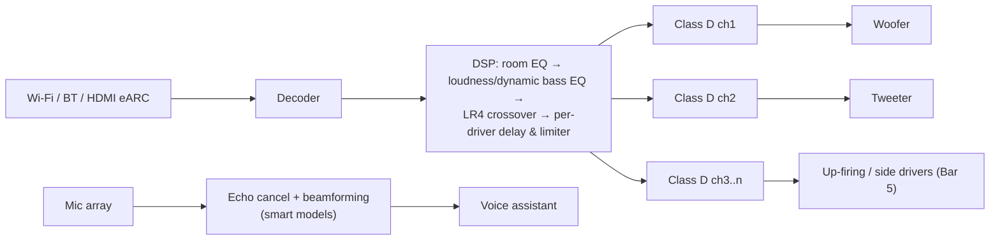
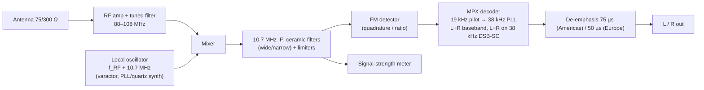
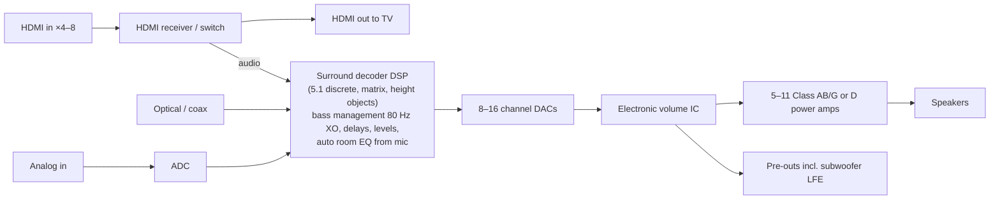

# Blueprints: Reference Designs

> **Generic reference designs**, not copies of any manufacturer's schematic. All model names are invented
> (see the [fictional catalog](README.md#fictional-catalog)). Component values are computed from the
> formulas shown so you can change them. Mains-powered builds are dangerous: tube amps hold 300–500 V DC
> and electrostatic speakers several kV. Simulate first (SPICE, Python), build only with proper training.

---

## 1. CD player blueprint

### 1.1 System block diagram (fits Aurion CDX-1 through Halden H-7)

```
 ┌──────────────────────────── MECHANISM ─────────────────────────────┐
 │  Spindle motor ◄── CLV drive        Sled motor ◄── sled drive      │
 │       │                                  │                         │
 │   [ DISC ]  ◄── laser spot ── [ OPTICAL PICKUP ]                   │
 │                     focus coil ◄┤  ├► tracking coil                │
 │                                 │                                  │
 └─────────────────────────────────┼──────────────────────────────────┘
                     A,B,C,D,E,F photodiode currents
                                   ▼
 ┌─────────── RF / SERVO ──────────┐      ┌──────── CONTROL ──────────┐
 │ RF = A+B+C+D                    │◄────►│ Microcontroller           │
 │ FE = (A+C) − (B+D)  → focus PID │      │  TOC, seek, keys, display │
 │ TE = E − F          → track PID │      │  IR remote, tray motor    │
 │ sled = LPF(track drive)         │      └────────────▲──────────────┘
 └───────────────┬─────────────────┘                   │ subcode Q
                 │ RF eye → slicer → PLL (4.3218 MHz)  │
                 ▼                                     │
 ┌──────────────── DECODER DSP ────────────────────────┴─────────────┐
 │ sync detect → EFM demod (14→8) → C1 RS(32,28) → de-interleave     │
 │ (D* delays, up to 108 frames) → C2 RS(28,24) → interpolate/mute   │
 │ CLV error → spindle      16 KB RAM (FIFO absorbs speed wobble)    │
 └───────────────┬───────────────────────────────────────────────────┘
                 │ I²S: BCK 2.8224 MHz, LRCK 44.1 kHz, DATA
                 ▼
 ┌── DIGITAL FILTER ──┐   ┌──── DAC ────┐   ┌──── ANALOG OUT ────────────┐
 │ 4×/8× FIR, de-emph │──►│ R-2R / ΔΣ   │──►│ I/V op-amp → 2nd/3rd order │──► RCA 2 V RMS
 │ (50/15 µs flag)    │   │             │   │ LPF → mute relay → buffer  │
 └────────────────────┘   └─────────────┘   └────────────────────────────┘
                 └──────────► S/PDIF transmitter (biphase-mark) ──► coax 75 Ω / optical
```

### 1.2 Key numbers
| Signal | Value |
|---|---|
| Channel bit clock | 4.3218 MHz = 7,350 frames/s × 588 bits |
| Frames per second | 7,350 (98 frames = 1 subcode block = 1/75 s "sector") |
| Audio per frame | 6 stereo samples (24 bytes) |
| Master clock | 16.9344 MHz (384 fs) or 11.2896 MHz (256 fs) |
| Pre-emphasis | 50 µs / 15 µs shelf; flagged in subcode, undone in the filter or analog stage |

### 1.3 Variant differences
| Fictional model | Pickup | Filter | DAC | Analog filter | Extra |
|---|---|---|---|---|---|
| Aurion CDX-1 | three-beam linear sled | none (1×) | 16-bit R-2R, one DAC multiplexed L/R (≈11 µs inter-channel delay) | 9th-order passive brick wall @ 20 kHz | — |
| Halden CP-14 | swing arm | 4× FIR + noise shaping | 14-bit dual DAC | 3rd-order Bessel | — |
| Aurion Pocket P-1 | three-beam, compact | 2× | 16-bit | 2nd-order | battery 6 V, headphone amp |
| Aurion P-10 ESP | three-beam | 8× | 1-bit | switched-cap | 4 Mbit DRAM buffer (≈3 s) |
| Veltro BitStream B-1 | three-beam | 8× + 256× noise shaper | 1-bit PDM | 3rd-order | — |
| Veltro Carousel C-5 | three-beam | 8× | 18-bit R-2R | 3rd-order | 5-disc turntable tray |
| Meridale T-1 / D-1 | swing arm / — | — / 8× custom long FIR | — / 20-bit multibit | — / 2nd-order | S/PDIF + AES, PLL re-clock |
| Halden H-7 | three-beam | selectable (sharp, slow, minimum-phase) | 32-bit ΔΣ | 3rd-order | USB-B input, balanced out |

### 1.4 Analog reconstruction filter (after an 8× oversampling DAC)
A 3rd-order Sallen-Key + RC low-pass, Butterworth, fc ≈ 50 kHz:

```
 DAC I/V out ──R1 2.2k──┬──R2 2.2k──┬────────┐
                        │           │       ┌┴┐ op-amp (unity gain)
                       C1          C2       │+├──┬──R3 1k──┬── OUT
                       2.2n        1.0n        └┬┘  │        C3 3.3n
                     (to output)             └───┘         ↓ GND
```
Values: Sallen-Key 2nd-order fc = 1/(2π√(R1R2C1C2)) ≈ 49 kHz (C1 ≈ 2·C2 gives Q ≈ 0.707); final RC pole
fc = 1/(2πR3C3) ≈ 48 kHz. C2 goes to ground, C1 back to the op-amp output.
Non-oversampling designs (CDX-1) instead need ≥ 60 dB attenuation by 24.1 kHz, which takes a 7–11th
order elliptic filter.

---

## 2. Loudspeaker blueprints

### 2.1 Driver electro-mechanical model (for simulation)

```
   Electrical         Mechanical (via Bl transformer)      Acoustic
  ┌─Re─Le─┐          ┌───Mms───Rms───Cms───┐              radiation
 V│       ├── Bl ────┤                     ├── Sd ── box compliance / port
  └───────┘          └─────────────────────┘
```
Input impedance:
`Z(ω) = Re + jωLe + Bl² / ( jωMms + Rms + 1/(jωCms) + Zbox(ω) )`
Cone velocity → far-field SPL ≈ `ρ0 · Sd · |a(ω)| / (2π r)` where a is cone acceleration.
Parameter conversions: `Cms = Vas / (ρ0 c² Sd²)`, `Fs = 1/(2π√(Mms·Cms))`, `Qes = 2πFs·Mms·Re / Bl²`.

### 2.2 Sealed box design (Kestrel AS-10, Kestrel M-3)
- `Qtc = Qts · √(1 + Vas/Vb)`
- `Vb = Vas / ((Qtc/Qts)² − 1)`
- `fc = Fs · Qtc / Qts`; for Qtc = 0.707, F3 = fc
- Worked example: Fs 25 Hz, Qts 0.35, Vas 80 L, target Qtc 0.707 → Vb = 80 / (4.08 − 1) ≈ **26 L**,
  fc ≈ **50 Hz**.

### 2.3 Ported box design (Torva Tower T-5, Kestrel K-8 Coax)
Empirical QB3-style alignment (for Qts ≈ 0.25–0.45):
- `Vb ≈ 15 · Qts^2.87 · Vas`
- `Fb ≈ 0.42 · Fs · Qts^−0.9`
- `F3 ≈ 0.26 · Qts^−1.4 · Fs`
- Port length (cm): `Lv = 23562.5 · Dv² · Np / (Fb² · Vb) − 0.732 · Dv` (Dv port diameter cm, Vb litres,
  Np number of ports)
- Worked example: Fs 32 Hz, Qts 0.38, Vas 45 L → Vb ≈ 42 L, Fb ≈ 32 Hz, F3 ≈ 32 Hz; one 7 cm port →
  Lv ≈ 23562.5·49 / (1024·42) − 5.1 ≈ **21.7 cm**.

### 2.4 Cabinet blueprint (Torva Tower T-5, 70 L net, ported 3-way)

```
   FRONT                    SIDE (section)
 ┌──────────┐            ┌──────────┐
 │   (o)    │ tweeter    │▒ sealed  │ ← mid sub-chamber 4 L, stuffed
 │  ( O )   │ 5" mid     │▒ chamber │
 │──────────│            │──────────│ ← 18 mm divider
 │  (  O  ) │ 8" woofer  │          │
 │          │            │  70 L    │   bracing every ≈25 cm
 │  (  O  ) │ 8" woofer  │  ported  │   lining: 25 mm foam/wool on walls
 │          │            │          │
 │   ( = )  │ port 7 cm  │ ══port══ │   port ≈22 cm long
 └──────────┘            └──────────┘
  W 250 × H 1050 × D 340 mm external, 18–25 mm MDF, baffle edges rounded R 15 mm
```

### 2.5 Passive crossover (two-way, 8 Ω, fc = 2.5 kHz)

Second-order Linkwitz-Riley (LR2):

```
 AMP + ──┬──── L1 1.0 mH ────┬────────────── WOOFER +
         │                   C2 4.0 µF
         │                   │
         │                  GND (AMP −) ──── WOOFER −
         │
         └──── C1 4.0 µF ────┬──── Rs ──┬─── TWEETER −  (reversed polarity for LR2)
                             L2 1.0 mH  Rp
                             │          │
                            GND ────────┴─── TWEETER +
```
Formulas (R = nominal impedance, f = crossover frequency):

| Type | Capacitor | Inductor | Tweeter polarity |
|---|---|---|---|
| 1st order | C = 1/(2πfR) = 7.96 µF | L = R/(2πf) = 0.51 mH | normal |
| 2nd Butterworth | C = 0.1125/(Rf) = 5.63 µF | L = 0.2251R/f = 0.72 mH | reversed |
| LR2 | C = 0.0796/(Rf) = 3.98 µF | L = 0.3183R/f = 1.02 mH | reversed |

- **L-pad** for A dB attenuation into Z: `Rs = Z(1 − 10^(−A/20))`, `Rp = Z·10^(−A/20) / (1 − 10^(−A/20))`.
  For 3 dB at 8 Ω: Rs ≈ 2.3 Ω, Rp ≈ 19.4 Ω.
- **Zobel** across the woofer: `Rz = 1.25·Re`, `Cz = Le / Rz²` (Re 6 Ω, Le 0.8 mH → 7.5 Ω, 14 µF).

### 2.6 Active / DSP speaker (Nimbus Pod 1, Nimbus Echo S, Nimbus Bar 5)


Excursion limiter: predict cone excursion from the T/S model in real time and reduce low bass when
`x > 0.9·Xmax`.

### 2.7 Electrostatic panel (Lumen Planar P-1)
```
   stator (−HV signal) ════════════════════  perforated metal, ≈2 mm gap
   diaphragm (+bias 5 kV, high R coating)  ─ ─ ─ 12 µm mylar
   stator (+HV signal) ════════════════════
   audio in → step-up transformer 1:50..1:100 → stators;  bias supply from mains via multiplier
```
Force is linear because the charge on the diaphragm stays constant (high-resistance coating).

---

## 3. Amplifier & receiver blueprints

### 3.1 Class AB solid-state power amp (Orbis R-270 / Orbis I-30 / Vexa AVR channels)

```
                      +Vcc (±45 V for 100 W/8 Ω; ±75 V for 270 W/8 Ω)
                        │
          ┌─────────────┼───────────────┬───────────────┐
          │      current mirror        R_vas_load    Q_drv_N ── Q_out_N (NPN)
 IN ─C─R─►Q1 ┐                          │ (CCS)          │        │
          │  ├ diff pair  ──► VAS (Q_vas, Miller C 100 pF)│     Re 0.22 Ω
 FB ─────►Q2 ┘                          │                 │        ├────┬── L 2 µH ‖ 10 Ω ──► SPEAKER
          │      tail CCS 2 mA      Vbe multiplier        │     Re 0.22 Ω  │
          │                         (bias, on heatsink)  Q_drv_P ── Q_out_P (PNP)
          │                             │                 │       Zobel 10 Ω + 100 nF
          └─────────────────────────────┴─────────────────┘        │
                        │                                         GND
                      −Vcc
 Feedback: output → Rf 22 kΩ → Q2 base; Q2 base → Rg 1 kΩ + Cg 100 µF → GND   Gain = 1 + Rf/Rg ≈ 23 (27 dB)
```
Design rules:
- Rail voltage: `Vpk = √(2·P·R)`, rails ≈ Vpk + 5 V (100 W/8 Ω → 40 V peak → ±45 V).
- Bias: 20–60 mA per output pair (Vbe multiplier sets ≈ 2.4–2.8 V across the drivers); class A
  (Strand A-50) sets bias ≥ peak load current/2, ≈ 1.5–2 A per channel.
- Output pairs: one per ≈ 50–80 W into 8 Ω; 270 W receivers use 3 pairs.
- Protection: DC-offset detector (> ±1 V) + overcurrent sense on Re → opens speaker relay.

### 3.2 Linear power supply
```
 MAINS ─ fuse ─ switch ─ soft-start ─ toroid (2×32 V AC for ±45 V) ─ bridge 35 A ─┬─ 2×10,000 µF ─ +Vcc
                                                                                └─ 2×10,000 µF ─ −Vcc
 Separate small winding → 7815/7915 regulators → preamp/tuner ±15 V
```
Rule of thumb: ≈ 2,000–5,000 µF per ampere of peak load current per rail.

### 3.3 Baxandall tone control (Calder Pre-9, Orbis R-270)
```
            ┌── C1 47n ──┬── C1' 47n ──┐
            │            │             │
 IN ── R1 10k ── BASS POT 100k lin ── R1' 10k ──┐
            │         (wiper)                  │
            │            └──── R2 3.3k ───┐    │
            │                             ├─── inverting op-amp (−) ── OUT
 IN ── C3 2.2n ── TREBLE POT 100k lin ── C3' 2.2n ── (wiper to (−))
```
Bass turnover ≈ 1/(2π·R1·C1) region (≈ 300 Hz), treble shelf ≈ 2–3 kHz; ±15 dB range, flat at
centre.

### 3.4 RIAA phono stage (MM)
- Time constants: **3180 µs (50.05 Hz), 318 µs (500.5 Hz), 75 µs (2122 Hz)**. Playback curve is
  +19.3 dB at 20 Hz, 0 dB at 1 kHz, −19.6 dB at 20 kHz.
- Gain ≈ 35–40 dB at 1 kHz for MM (5 mV → ≈ 0.5 V), 47 kΩ ‖ 100–200 pF input load.
```
 IN ─ 47k ‖ 150p ─► (+) op-amp ── OUT ─┬─────── R3 (sets 75 µs with C3) ─────────────┐
                    (−) ◄─ Rg 100 Ω ─ 220 µF ─ GND                                    │
                    (−) ◄─ [ R1 ‖ C1 (3180 µs) ] series [ R2 ‖ C2 (318 µs) ] ── OUT   └─ C3 ─ GND
 (feedback network sets the 3180/318 µs bass section; passive R3/C3 after it sets 75 µs)
```
Illustrative starting values: R1 220 kΩ with C1 14.5 nF (3180 µs); R2 22 kΩ with C2 14.5 nF (318 µs);
R3 7.5 kΩ with C3 10 nF (75 µs). The sections interact, so fine-tune in SPICE or with an RIAA calculator
until the error is < ±0.2 dB from 20 Hz to 20 kHz.

### 3.5 Push-pull tube power amp (Calder Tube 75)
```
 IN ─► V1a 12AX7 voltage amp ─► V1b/V2 long-tail-pair phase splitter (12AU7)
        ─► V3, V4 KT88-type pentodes, push-pull, ultralinear taps ─► OUTPUT TRANSFORMER
           (primary 4.3 kΩ plate-to-plate, B+ ≈ 480 V, fixed bias −50 V)  ─► 4/8/16 Ω taps ─► SPEAKER
        Global feedback from 16 Ω tap → V1a cathode (≈ 15–20 dB)
 PSU: power transformer → solid-state or tube rectifier → choke-input or CLC filter (B+), 6.3 V heaters
```
Emulation traits: soft symmetric clipping, ≈ 1 Ω output impedance (damping factor ≈ 8–12, so the
speaker's impedance curve shapes the response), transformer LF saturation, rising 2nd/3rd harmonics.

### 3.6 Class D (Vexa D-100, Vexa AVR-9 heights, Nimbus speakers)
```
 PCM/I²S ─► DSP (EQ, volume, room correction) ─► PWM modulator (≈ 400 kHz – 1.5 MHz)
         ─► gate driver ─► GaN/MOSFET half or full bridge (supply 24–60 V)
         ─► LC filter (L 10 µH, C 680 nF → fc ≈ 60 kHz) ─► SPEAKER
         ◄─ post-filter feedback for load-independent response
```

### 3.7 FM stereo tuner section (Orbis R-270, Vexa AVR-5)


### 3.8 A/V receiver (Vexa AVR-5 / AVR-9)

Bass management: channels set to "small" are high-passed at 80 Hz (LR4) and their low bass is summed
with LFE (+10 dB) to the subwoofer output.
