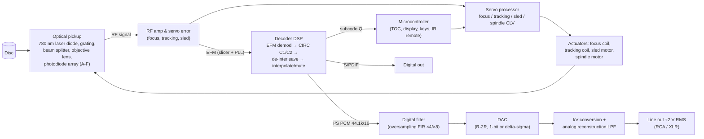

# CD Players: 1982 – Now

## 1. The format in one table (Red Book, IEC 60908)

| Parameter | Value |
|---|---|
| Sample rate / resolution | 44.1 kHz, 16-bit linear PCM, 2 channels |
| Audio data rate | 1,411.2 kbit/s |
| Disc diameter / thickness | 120 mm (80 mm "single") / 1.2 mm polycarbonate |
| Track pitch | 1.6 µm, single spiral from inside out |
| Scanning speed | 1.2 – 1.4 m/s, Constant Linear Velocity (≈500 rpm at the hub → ≈200 rpm at the rim) |
| Laser | 780 nm infrared, objective NA 0.45 |
| Pit width / length | ≈0.5 µm wide, 0.83 – 3.05 µm long (3T – 11T) |
| Channel code | EFM (Eight-to-Fourteen Modulation) + 3 merging bits |
| Channel bit rate | 4.3218 Mbit/s |
| Error correction | CIRC (Cross-Interleaved Reed-Solomon Code), C1 (32,28) + C2 (28,24) |
| Frame | 588 channel bits = 24 audio bytes + 4 C2 parity + 4 C1 parity + 1 subcode byte + sync |
| Subcode | 8 channels P–W; Q carries track/index/time (TOC in lead-in) |
| Max playing time | 74 min (standard), 80 min (common later) |

## 2. History

> All brand and model names in this research are **invented** (see the [fictional catalog](README.md#fictional-catalog)).
> The history describes what the industry did, not specific trademarked products.

### 1979–1982: Invention
- Two large electronics companies (one Dutch, one Japanese) jointly developed the format; the standard
  (Red Book) was finalized in 1980.
- **October 1982**: the first commercial player goes on sale in Japan. Our stand-in is the
  **Aurion CDX-1**: front-loading tray, non-oversampling 16-bit DAC, three-beam laser pickup.
- **Late 1982 / early 1983**: the European partner's first player, our **Halden CP-14**: top loader with a
  **single-beam swinging-arm** pickup, a **14-bit DAC** and a **4× oversampling digital filter**. Reaching
  CD-grade performance with 14 bits through oversampling was an early sign of where DAC design would go.

### 1983–1989: Growth and refinement
- Prices fell from ≈$900–1,000 to under $200 by the late 80s.
- **1984**: the first portable CD player, our **Aurion Pocket P-1**, roughly four CD cases stacked.
- Car CD players appear (1984).
- **Oversampling** (2×, 4×, 8×) became standard, letting designers replace steep "brick-wall" analog
  filters (with big phase shift) by gentle filters after a digital FIR filter.
- **Multi-bit R-2R DACs** went from 16 to 18 and then 20 bits; the best-trimmed parts are still prized.
- **1989: 1-bit DACs** (bitstream / multi-stage noise shaping) trade bit depth for very high rate and
  noise shaping and avoid R-2R linearity problems. Our stand-in: **Veltro BitStream B-1**.
- **Carousel and magazine changers** (5-disc carousels, 6-disc magazines): our **Veltro Carousel C-5**.
- **CD-R** standard (Orange Book) in 1988; affordable consumer CD-R recording in the 90s.

### 1990s: Mass market and high end diverge
- **Anti-skip / electronic shock protection**: portables buffer 3–10 s (later 40+ s with compression)
  of audio in DRAM so playback continues while the servo re-finds the track.
- **Separate transports + DACs** rise in high-end hi-fi, our **Meridale T-1 transport + D-1 DAC**. The
  link is **S/PDIF** (coax 75 Ω or optical) or AES/EBU (110 Ω balanced). Jitter becomes a major topic.
- LSB-embedded "extra resolution" encodings appear (1995).
- **Mega-changers**: 100–400 disc jukeboxes.
- **CD-RW** (1997) and players that read CD-R/RW.

### 2000s: Formats multiply, CD players shrink in importance
- **SACD** (1999, DSD 1-bit at 2.8224 MHz) and **DVD-Audio** (2000, up to 24/192) as successors;
  neither replaced CD.
- **MP3/WMA CD playback** in portables and car units (~2000+), then hard-drive and flash music players
  erode CD use.
- DVD and then Blu-ray "universal players" absorb CD playback.
- DAC chips move almost entirely to multi-level delta-sigma designs.

### 2010s – now: Niche, revival, and the transport-plus-DAC model
- Streaming takes over; many brands stop making CD players.
- Remaining players are mostly hi-fi models or **transports** feeding external DACs, some with USB DAC
  inputs and streaming built in. Our stand-in: **Halden H-7**.
- A major DAC-chip factory fire in **October 2020** forced many products to switch DAC suppliers.
- Renewed interest in physical media since the early 2020s: CD sales stabilised and in some markets grew
  modestly. Ripping to lossless (FLAC/ALAC) is a common "CD-as-source" workflow.

## 3. How a CD player works

### Optical pickup
- **Three-beam** (most mass-market players): a diffraction grating splits the beam; two side spots measure
  tracking error (E − F), the main spot reads data on a 4-quadrant photodiode (A+B+C+D = RF) and focus
  error via an astigmatic lens ((A+C) − (B+D)).
- **Single-beam swing arm**: a rotary arm moves radially; tracking error comes from
  the main spot (push-pull). Admired for robustness and tracking.
- Two mechanism styles: linear sled (worm gear or linear motor) and rotary swing arm.

### Servos (four control loops)
| Loop | Sensor | Actuator | Notes |
|---|---|---|---|
| Focus | astigmatic focus error | voice-coil in lens | keeps spot within ≈±1 µm depth of field |
| Tracking | three-beam or push-pull error | lens tracking coil | follows ±70 µm eccentricity |
| Sled | DC component of tracking drive | sled motor / worm gear | moves the whole pickup slowly |
| Spindle (CLV) | EFM frame rate vs crystal | spindle motor | keeps channel bit rate at 4.3218 MHz |

### Decoding chain
1. **Slicer + PLL** turn the analog RF eye pattern into a channel bit clock and bits.
2. **Sync detection** finds the 24-bit frame sync (11T + 11T pattern).
3. **EFM demodulation**: lookup table from 14-bit symbols to 8-bit bytes (256 valid of 16,384).
4. **C1 decoder**: RS(32,28) corrects up to 2 symbol errors per frame (often configured to correct 1 and
   flag 2+).
5. **De-interleave**: up to 108 frames of delay spreads burst errors (scratches) across many C2 words.
6. **C2 decoder**: RS(28,24) corrects remaining errors using C1 erasure flags.
7. **Concealment**: if uncorrectable, **interpolate** between neighbours or **mute**. CIRC can correct
   bursts of ≈3,500 bits (≈2.4 mm of track) and conceal ≈12,000 bits (≈8.5 mm).

### Digital-to-analog conversion
| DAC type | Era | How it works | Examples |
|---|---|---|---|
| Multibit R-2R / current-segment | 1982–90s, revived in boutique DACs | weighted current sources summed into I/V stage | 14–20 bit, laser-trimmed MSBs |
| 1-bit / bitstream / multi-stage noise shaping | 1989–late 90s | very high rate 1-bit stream, noise-shaped, with switched-capacitor filter | 1-bit at 128–256× fs |
| Multi-level delta-sigma | mid-90s – now | 3–6 bit modulator at 64–256× fs, dynamic element matching | 24–32 bit input, 120–130 dB DNR |

## 4. Fictional models to emulate

| Fictional model | Archetype | Distinguishing behaviour to emulate |
|---|---|---|
| **Aurion CDX-1** (1982) | first-gen front loader | non-oversampling 16-bit DAC with steep analog filter (phase shift near 20 kHz), slow track access |
| **Halden CP-14** (1983) | first-gen top loader | 14-bit DAC + 4× oversampling, swing arm |
| **Aurion Pocket P-1** (1984) / **P-10 ESP** (1995) | portable | battery, ESP buffer, skip behaviour |
| **Veltro BitStream B-1** (1990) | 1-bit era | noise-shaped 1-bit DAC, rising HF noise floor above 20 kHz |
| **Veltro Carousel C-5** (1992) | 5-disc changer | disc selection, random play across discs, load time |
| **Meridale T-1 + D-1** (1996) | high-end split | S/PDIF link, jitter, upsampling filters |
| **Halden H-7** (2022) | modern hi-fi | delta-sigma DAC, selectable filters, USB input |

## 5. Failure modes (useful for realistic emulation)
- Laser diode ageing → lower RF amplitude → more C1/C2 errors → skips/mutes on CD-R first.
- Dried grease on sled rails → sled sticks, long seeks.
- Belt-driven trays slip (very common on 80s/90s units).
- Spindle motor wear → CLV hunting at disc start.
- Leaking capacitors in power supply → hum, random resets.

See [blueprints.md § CD player](blueprints.md#1-cd-player-blueprint) for the reference design and
[emulation-spec.md](emulation-spec.md#cd-player-module) for the software model.
