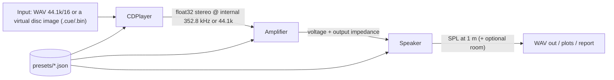

# Emulation Spec (hand this to Codex or another coding agent)

Goal: a software emulator that plays audio through a virtual **CD player → amplifier/receiver →
speaker** chain and reproduces the sound and behaviour of each fictional model in the
[catalog](README.md#fictional-catalog). Read [blueprints.md](blueprints.md) for the circuits and formulas.

## 0. Ground rules for the implementer
- Language: **Python 3.11+** with `numpy` and `scipy` (offline rendering). Optional real-time front-end
  later (Web Audio / JUCE).
- All devices are **data-driven presets** (JSON) plus a small set of DSP blocks. No model name may be
  hard-coded in DSP code.
- Use only the invented names in this repo. Do not add real brand or model names.
- Every block has a unit test with a measurable target (frequency response, THD, timing).

## 1. Architecture



Suggested layout:
```
audio_emu/
  core/        block.py (Block base: process(x, fs) -> y), filters.py, nonlinear.py, measure.py
  cd/          disc.py, servo.py, circ.py, dac.py, player.py
  amp/         preamp.py, tone.py, riaa.py, power_stage.py, tube.py, classd.py, tuner_fm.py, avr.py
  speaker/     ts_driver.py, box.py, crossover.py, active.py
  presets/     cd/*.json, amp/*.json, speaker/*.json
  cli.py       python -m audio_emu render --cd aurion_cdx1 --amp orbis_r270 --spk kestrel_as10 in.wav out.wav
  tests/
```

The **electrical interface between amp and speaker must be modeled**, not just chained gains:
the amp is a voltage source `Vout` with output impedance `Zout(f)` driving the speaker's impedance
`Zspk(f)` → `Vspk = Vout · Zspk/(Zspk + Zout + Zcable)`. This is what makes a tube amp sound different on
different speakers.

## CD player module

| Block | Behaviour | Parameters |
|---|---|---|
| `Disc` | holds PCM + simulated defect map (scratches as bit-error bursts by position) | `defects: [{t_sec, length_mm, severity}]` |
| `Pickup/Servo` | converts defects into C1/C2 error rates; models seek time | `laser_health 0–1`, `seek_ms_per_track`, `sled_type` |
| `CIRC` | real RS(32,28)/RS(28,24) + interleave on synthetic frames (optional "fast mode": statistical) | `correction_strategy` |
| `Concealment` | linear interpolation of flagged samples, mute if > N in a row | `max_interp_samples` |
| `ESP buffer` | portables: skip-free while buffer > 0, then audible skip/mute | `buffer_sec`, `shock_events` |
| `DigitalFilter` | 1×, 2×, 4×, 8× oversampling FIR; filter types sharp / slow / min-phase | `os_factor`, `taps`, `type` |
| `DAC` | R-2R with per-bit weight errors (DNL), or ΔΣ modulator (order, levels) | `bits`, `bit_error_lsb[]`, `ds_order`, `ds_levels` |
| `AnalogLPF` | Butterworth / Bessel / elliptic, order, fc | `type`, `order`, `fc` |
| `Output` | gain to line level, output impedance, inter-channel delay | `vout_rms`, `zout_ohm`, `ch_delay_us` |

Preset example (`presets/cd/aurion_cdx1.json`):
```json
{
  "name": "Aurion CDX-1", "year": 1982, "kind": "cd_player",
  "transport": {"sled_type": "linear", "seek_ms_per_track": 900, "laser_health": 1.0},
  "digital_filter": {"os_factor": 1},
  "dac": {"type": "r2r", "bits": 16, "bit_error_lsb": [0.6, -0.3, 0.2, 0.1], "multiplexed": true},
  "analog_lpf": {"type": "elliptic", "order": 9, "fc": 20500},
  "output": {"vout_rms": 2.0, "zout_ohm": 470, "ch_delay_us": 11.3},
  "esp": null
}
```

## Amplifier module

| Block | Behaviour | Parameters |
|---|---|---|
| `InputSelector` | routes CD/tuner/phono/aux | — |
| `RIAA` | exact bilinear-transformed RIAA (3180/318/75 µs) + MM loading | `gain_db`, `load_pf` |
| `Volume` | log taper, channel tracking error at low settings | `taper`, `tracking_error_db` |
| `Tone` | Baxandall shelves, loudness compensation | `bass_db`, `treble_db`, `turnover_hz` |
| `PowerStage` | gain, rail clipping (hard/soft), crossover distortion (class B/AB dead-zone with bias), slew limit, output impedance, protection relay | `rails_v`, `class`, `bias_ma`, `slew_v_per_us`, `zout_ohm`, `clip` |
| `TubeStage` | asymmetric triode waveshaper + push-pull cancellation, output transformer (HP + LP + LF saturation), sag from PSU | `drive`, `ot_primary_l`, `sag` |
| `ClassD` | PWM is not simulated by default; model LC filter response vs load + DSP EQ | `l_uh`, `c_nf`, `feedback: "post_filter"` |
| `PSU` | rail droop vs current (RC model) → sag on bursts | `cap_uf`, `transformer_r` |
| `FMTuner` | optional: synthesize MPX from stereo input, add noise vs signal strength, decode with pilot PLL + de-emphasis | `deemph_us`, `snr_db`, `blend` |
| `AVR` | bass management (80 Hz LR4 + LFE sum), channel delays, matrix upmix | `channels`, `crossover_hz` |

Preset example (`presets/amp/orbis_r270.json`):
```json
{
  "name": "Orbis R-270", "year": 1978, "kind": "receiver",
  "power_stage": {"class": "AB", "rails_v": 75, "bias_ma": 40, "slew_v_per_us": 30,
                  "zout_ohm": 0.08, "clip": "hard", "rated_w_8ohm": 270},
  "psu": {"cap_uf": 44000, "transformer_r": 0.15},
  "tone": {"bass_db": 0, "treble_db": 0, "turnover_hz": 300, "loudness": false},
  "phono": {"gain_db": 36, "load_pf": 150},
  "tuner": {"deemph_us": 75, "snr_db": 70}
}
```
`presets/amp/calder_tube75.json` uses `"power_stage": {"class": "tube_pp", "zout_ohm": 1.0, "clip": "soft"}`
plus a `tube_stage` block.

## Speaker module

| Block | Behaviour | Parameters |
|---|---|---|
| `TSDriver` | lumped electro-mechanical model from T/S params → impedance + SPL; optional nonlinear Bl(x), Cms(x) | `fs, qts, qes, qms, vas, re, le, bl, mms, sd, xmax, sens_db` |
| `Box` | sealed / ported / passive radiator / dipole / horn (approximate as HP + gain) | `type, vb_l, fb_hz, ql` |
| `Crossover` | build passive network from component list and solve with complex impedance (nodal analysis per frequency) **including the driver's impedance** | `components: [...]` |
| `ActiveSpeaker` | DSP XO (LR4), EQ, excursion limiter, internal Class D | `xo_hz, eq[], limiter` |
| `Room` (optional) | simple boundary gain + a few modal peaks | `room_dims_m` |

Preset example (`presets/speaker/kestrel_as10.json`):
```json
{
  "name": "Kestrel AS-10", "year": 1972, "kind": "passive_2way",
  "woofer": {"fs": 19, "qts": 0.36, "vas": 160, "re": 6.0, "le": 1.2, "bl": 9.5, "mms": 55, "sd": 330, "xmax": 6},
  "tweeter": {"fs": 1100, "sens_db": 89, "re": 5.0},
  "box": {"type": "sealed", "vb_l": 40},
  "crossover": {"order": 1, "fc": 1500, "tweeter_lpad_db": 2.5}
}
```
(Qtc = 0.36·√(1+160/40) ≈ 0.80, fc ≈ 42 Hz — matches the catalog's F3 ≈ 45 Hz.)

## 2. Rendering pipeline
1. Load WAV → `CDPlayer.process` (upsample internally to `fs × os_factor`, then back to 96 kHz output).
2. `Amplifier.process` with volume set so a −20 dBFS sine gives the requested watts.
3. `Speaker.process`: compute `Zspk(f)`, apply amp `Zout` divider, crossover, driver SPL responses,
   sum; convert to output WAV normalised to a fixed SPL reference.
4. Write `report.md` with plots: frequency response, impedance, THD vs power, step response.

## 3. Acceptance tests (Codex should make these pass)
| Test | Target |
|---|---|
| CD 1 kHz −0 dBFS, 8× filter | THD+N < 0.005% (ΔΣ preset), < 0.02% (16-bit R-2R preset with bit errors) |
| CD NOS (Aurion CDX-1) | −3.2 dB ± 0.3 at 20 kHz from zero-order hold + filter ripple per preset |
| CIRC | burst of 3,500 bits fully corrected; 12,000 bits concealed (interpolated) without mute |
| ESP | 2 s shock with 3 s buffer → no gap; 5 s shock → audible gap ≥ 2 s |
| RIAA | within ±0.1 dB of standard 20 Hz–20 kHz (after inverse-RIAA test signal) |
| Power stage | Orbis R-270 clips at 270 W ± 10% into 8 Ω; class B mode shows crossover distortion > class AB at 1 W |
| Tube amp on Kestrel M-3 | response varies by ≥ 1 dB following the speaker impedance curve |
| Sealed box | Kestrel AS-10 F3 within ±3 Hz of formula |
| Ported box | Torva Tower T-5 impedance shows twin peaks with dip at Fb ± 2 Hz |
| LR2 crossover | summed on-axis response flat ± 0.5 dB with ideal resistive drivers |
| FM tuner | 19 kHz pilot recovered, stereo separation > 40 dB at 1 kHz |

## 4. Milestones
1. `core` blocks + measurement tools + tests.
2. CD player (filters/DAC/analog first; CIRC + defects second).
3. Amplifier (power stage, PSU, tone, RIAA; tube; Class D; tuner; AVR bass management).
4. Speaker (T/S, boxes, crossover solver, active).
5. CLI, presets for every catalog model, A/B listening renders, report generator.
