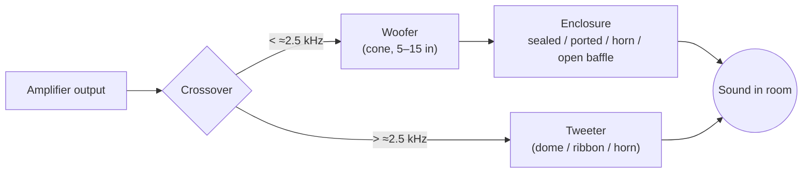
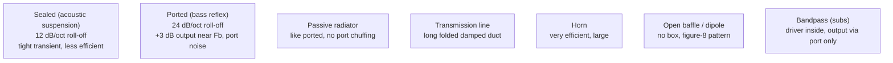

# Loudspeakers: 1970s – Now

> All brand and model names are **invented** (see the [fictional catalog](README.md#fictional-catalog)).

## 1. Core concepts

A loudspeaker turns the amplifier's voltage into air movement. A **driver** (voice coil in a magnet gap,
attached to a cone or dome) moves air. The **enclosure** controls the back wave, and the **crossover**
sends each frequency band to the right driver.



### Anatomy of a moving-coil driver

```
           ┌──── frame (basket)
   surround│  ╭───────── cone / diaphragm ─────────╮
     ╭─────┤ ╱                                      ╲
     │     │╱        dust cap ╭──╮                   ╲
     │     │                  │  │  ← voice coil former
     │  spider (suspension) ══╪══╪══
     │     │      ┌───────────┴──┴───────────┐
     │     │      │ top plate  ║ coil ║ gap  │  ← magnet (ferrite, alnico or neodymium)
     │     │      │  MAGNET    ║      ║      │
     │     │      └──── pole piece / back plate
```

### Thiele-Small (T/S) parameters
Published in the early 1970s (Thiele 1961/1971; Small 1972–73), these turned box design into
engineering. They are what you need to emulate a driver:

| Symbol | Meaning | Typical 8-in woofer |
|---|---|---|
| Fs | free-air resonance | 30–45 Hz |
| Qts | total Q (Qes ‖ Qms) | 0.3–0.5 |
| Vas | air volume with the same compliance as the suspension | 30–60 L |
| Re | voice-coil DC resistance | 5.5–6.5 Ω |
| Le | voice-coil inductance | 0.5–1.5 mH |
| Bl | force factor | 6–10 T·m |
| Mms | moving mass | 20–40 g |
| Sd | cone area | ≈220 cm² |
| Xmax | linear excursion | 4–8 mm |
| η0 / sensitivity | efficiency | 86–90 dB SPL at 2.83 V / 1 m |

## 2. History by decade

### 1970s: Bookshelf boom, horns, and the science of the box
- **Acoustic suspension** (sealed box, invented in the 1950s) dominates mass-market bookshelf speakers:
  deep bass from a small box at the cost of efficiency. Stand-in: **Kestrel AS-10** (1972).
- **Bass reflex** comes back once Thiele-Small alignments make ports predictable.
- **Horn-loaded** and high-efficiency designs (100+ dB/W) suit the low-power tube amps still around, and
  are big in pro sound. Stand-in: **Torva Horn H-1** (1975).
- **Broadcaster mini-monitors** (1975): tiny sealed two-way boxes designed for near-field monitoring in
  outside-broadcast vans, famous for midrange accuracy. Stand-in: **Kestrel M-3** (1976).
- **Ferrofluid** in tweeter gaps for cooling and damping.
- **Direct/reflecting** speakers bounce most of the sound off the wall behind.
- Disco and rock push **big three-way floor-standers** with 12–15 in woofers.

### 1980s: New materials, monitors and the audiophile high end
- **Polypropylene cones** (late 70s/80s), metal-dome tweeters (aluminium, titanium).
- **Neodymium magnets** (mid-80s) shrink drivers.
- **Near-field studio monitors** with a white paper woofer become the mixing standard (1978–80s).
  Stand-in: **Torva Studio N-10** (1980).
- **Electrostatic and planar-magnetic** panels: very low-mass diaphragms, dipole radiation.
  Stand-in: **Lumen Planar P-1** (1981).
- **Time-aligned / sloped baffles** and **modular high-end towers** (late 80s) aim at phase coherence.
- Floor-standing **towers** with multiple woofers: **Torva Tower T-5** (1985).
- **Linkwitz-Riley crossovers** (published 1976) become the standard for flat summed response.
- **Point-source coaxial drivers** (tweeter in the woofer's centre), stand-in **Kestrel K-8 Coax** (1990).

### 1990s: Home theater and computer-aided design
- 5.1 home theater creates **satellite + subwoofer** systems, **centre channels** and **powered subs**
  with built-in plate amps.
- **Laser interferometry and Klippel-style measurement**, FEA and CAD make driver design much faster.
- **Shielded** drivers for use next to CRT TVs.
- Exotic tweeter materials: beryllium, diamond (CVD), ceramic.

### 2000s: Powered, wireless, small
- **Powered speakers** (amp + active crossover inside) for desktops and studios.
- **Multi-room wireless** speakers (mid-2000s), stand-in: **Nimbus Pod 1** (2006).
- **Line arrays** in pro audio, **in-wall/in-ceiling** custom installs at home.

### 2010s: Bluetooth, smart and DSP-everything
- Portable **Bluetooth speakers** (2010+).
- **Smart speakers** with far-field microphones and voice assistants (2014+). Stand-in: **Nimbus Echo S**.
- **Soundbars** with virtual surround and upward-firing drivers. Stand-in: **Nimbus Bar 5** (2018).
- **Automatic room correction** using the device's microphone or a phone.
- **Active "wireless hi-fi"** bookshelf speakers with built-in DAC, streaming and Class D amps.

### 2020s
- **DSP-corrected compact speakers** with tiny long-throw woofers + passive radiators.
- **Spatial audio / height channels** and beam-steering arrays.
- **GaN Class D** in active speakers; sustainability (repairable modules, recycled cones).
- Vintage speaker restoration (re-foaming surrounds, recapping crossovers) is a strong hobby.

## 3. Enclosure types compared



| Type | Box size for 8-in woofer | F3 (≈) | Sensitivity | Best for |
|---|---|---|---|---|
| Sealed (Qtc 0.707) | 20–40 L | 50–60 Hz | 86–88 dB | accuracy, room gain |
| Ported (QB3/B4) | 30–50 L | 35–45 Hz | 87–89 dB | bass extension |
| Horn (bass) | 200+ L | 40 Hz | 95–105 dB | low-power amps, PA |
| Open baffle | flat panel | 60+ Hz | 85 dB | spacious imaging |

## 4. Crossover basics
- **First-order** (6 dB/oct): one cap for tweeter, one inductor for woofer; phase coherent, lots of overlap.
- **Second-order** (12 dB/oct): tweeter wired in reverse polarity for Butterworth; LR2 needs this too.
- **Fourth-order Linkwitz-Riley** (24 dB/oct): flat sum, drivers in phase; standard in active designs.
- **Zobel** (series R + C across woofer) flattens rising voice-coil impedance; **L-pad** attenuates the
  tweeter to match sensitivity.
- Active / DSP crossovers (2000s+) add delay and EQ per driver.

## 5. Fictional models to emulate

| Fictional model | Year | Type | Key specs (for emulation) |
|---|---|---|---|
| **Kestrel AS-10** | 1972 | 2-way sealed bookshelf, 10-in woofer | 40 L, Qtc 0.7, F3 45 Hz, 86 dB, 8 Ω, 1st-order XO @ 1.5 kHz |
| **Torva Horn H-1** | 1975 | 3-way corner horn | 103 dB, F3 40 Hz, compression mid/tweeter horns |
| **Kestrel M-3** | 1976 | 2-way mini monitor, 5-in + 0.75-in dome | 5 L sealed, F3 80 Hz, 83 dB, 15 Ω, bumped mid-bass |
| **Torva Studio N-10** | 1980 | near-field monitor, 7-in + 1-in dome | 12 L sealed, F3 60 Hz, 90 dB, mid-range forward peak ≈1.5–2 kHz |
| **Lumen Planar P-1** | 1981 | full-range electrostatic dipole | 85 dB, impedance 2–30 Ω, step-up transformer, needs 230 V bias |
| **Torva Tower T-5** | 1985 | 3-way ported floorstander, 2×8-in + 5-in + 1-in | 70 L, Fb 32 Hz, 90 dB, LR4 XO @ 400 Hz / 3 kHz |
| **Kestrel K-8 Coax** | 1990 | 2-way coaxial, 6.5-in with central tweeter | 9 L ported, 87 dB, point-source dispersion |
| **Nimbus Pod 1** | 2006 | powered wireless 2-way | 2×25 W Class D, DSP XO, bass EQ boost |
| **Nimbus Echo S** | 2015 | smart speaker, 360° | 2.5-in woofer + 0.6-in tweeter, 7 mics, DSP loudness |
| **Nimbus Bar 5** | 2018 | 5.0.2 soundbar | up-firing drivers, beam forming, virtual surround |

See [blueprints.md § Speakers](blueprints.md#2-loudspeaker-blueprints) and
[emulation-spec.md](emulation-spec.md#speaker-module).
